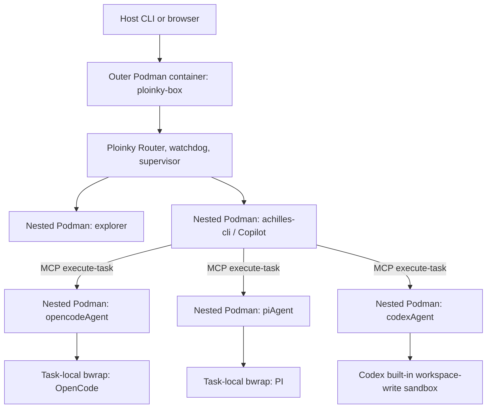
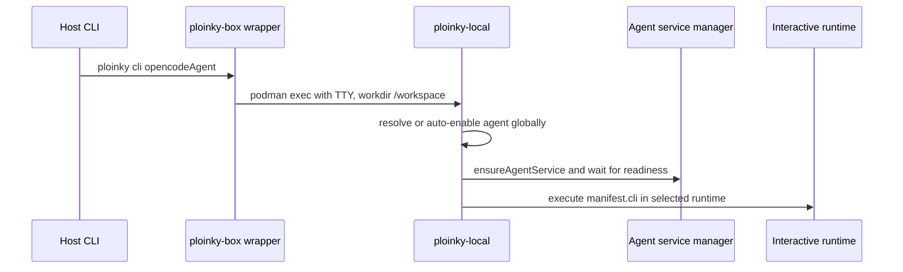
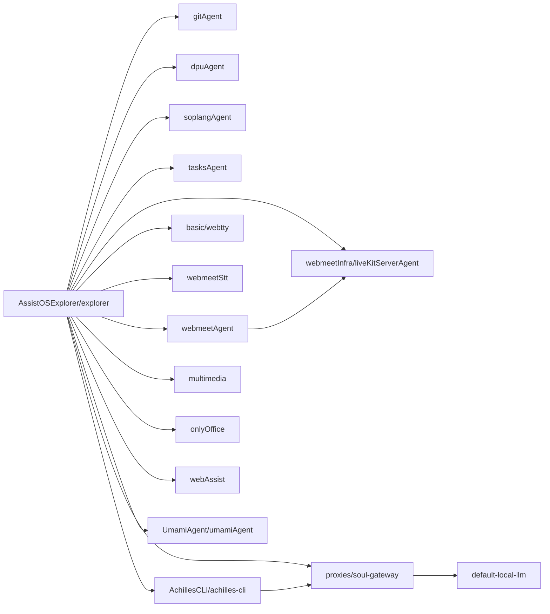
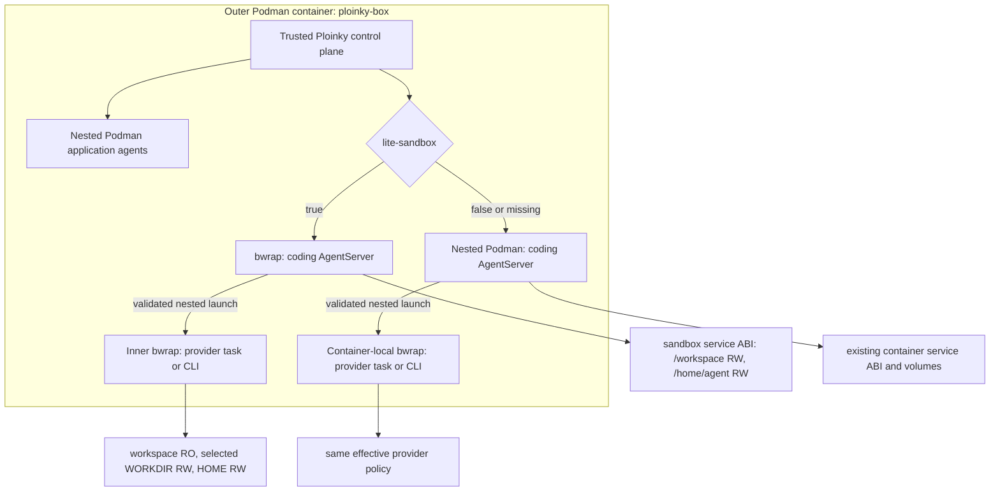
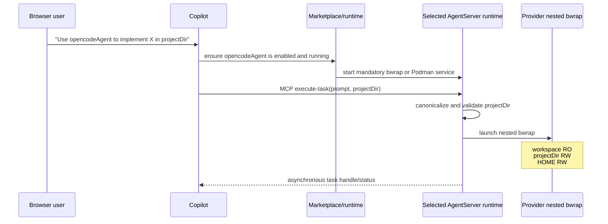
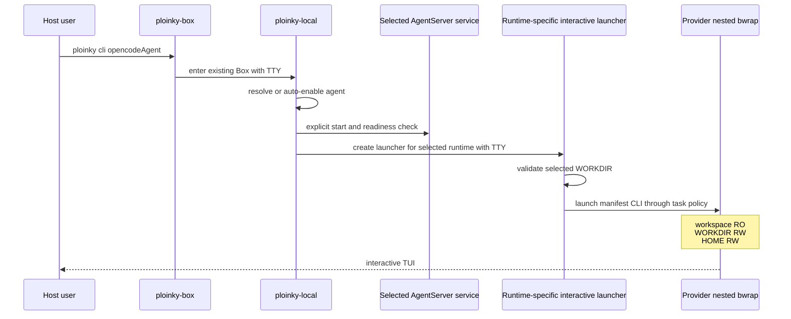

# Dual-Runtime Architecture for Coding Agents in Ploinky Box

Analysis date: 2026-08-04; revised 2026-08-06

Status: runtime architecture implemented through Phase 10E; immutable image rebuild and managed drill remain Phase 10F

## 1. Executive summary

`ploinky-box` remains the single outer Podman container and the deployment boundary for Ploinky. Inside that Box, Ploinky becomes a hybrid runtime:

| Workload | Runtime inside `ploinky-box` |
| --- | --- |
| `opencodeAgent`, `codexAgent`, `piAgent`, and equivalent coding agents | selector-controlled: Bubblewrap when `lite-sandbox: true`; nested Podman when false or missing |
| The provider process launched by a coding agent | nested `bwrap` inside the selected AgentServer runtime |
| Router, Box supervisor, watchdog, and Ploinky control plane | trusted Box processes |
| Explorer and ordinary application agents | nested Podman unless migrated separately |
| OnlyOffice, LiveKit, STT, WebTTY, Soul Gateway, local LLM, Umami, and other image-dependent services | nested Podman |

The target does not add a generic `runtime.isolation` object. It reuses the existing manifest signal:

```json
{
  "startup": "manual",
  "lite-sandbox": true,
  "container": "docker.io/assistos/ploinky-node:<approved-tag-or-digest>"
}
```

Inside the Box, the contract is deliberately small:

| Manifest state | Runtime decision |
| --- | --- |
| `lite-sandbox: true` on Linux or inside Box | `bwrap` is mandatory |
| `lite-sandbox: true` on macOS | Seatbelt is mandatory |
| missing or `lite-sandbox: false` | Podman is mandatory |
| selected backend is unavailable, fails admission, or fails to launch | fail closed; never switch to the other runtime |

The selector applies to every agent. It is not tied to an agent-name allowlist. A manifest may keep a `container` declaration while `lite-sandbox` is true: sandbox mode ignores that dormant declaration, while false or missing selects it. This lets the same coding manifest run in either supported mode by changing only the selector. Image-dependent agents remain false or missing unless their complete sandbox compatibility has been proved.

`startup` is independent from isolation. `startup: "manual"` prevents automatic revival during a general workspace start, but an explicit browser delegation or `ploinky cli <agent>` may still start the agent.

The target has two trust levels:

| Level | Role | Workspace access |
| --- | --- | --- |
| trusted outer coding AgentServer | MCP/OpenAI endpoints, task queue, validation, nested launch | complete workspace RW |
| actual provider CLI/task | OpenCode, Codex, PI, and their child commands | complete workspace RO, selected launch directory RW, private HOME RW |

The provider may be launched in any canonical directory below `/workspace`. Once launched, it can write only to that directory subtree and its own HOME. Other workspace content remains readable but not writable. Ploinky control-plane secrets and other agents' homes are hidden rather than merely mounted read-only.

The provider boundary is intentional in both outer modes:

```text
ploinky-box
├── lite-sandbox: true
│   └── bwrap: opencodeAgent AgentServer (trusted, workspace RW)
│       └── bwrap: OpenCode task or TUI (workspace RO, WORKDIR RW, HOME RW)
└── lite-sandbox: false or missing
    └── Podman: opencodeAgent AgentServer (existing container ABI)
        └── bwrap: OpenCode task or TUI (same provider policy)
```

OpenCode and PI already contain most of the task-local nested-bwrap mechanism. Codex must be brought under the same Ploinky boundary instead of relying only on its built-in `workspace-write` sandbox.

## 2. Scope and evidence labels

This document covers the current implementation in:

| Area | Repository or directory |
| --- | --- |
| Box lifecycle, runtime selection, bwrap, CLI, Router | `ploinky/` |
| Copilot and coding agents | `AchillesCLI/` |
| Explorer dependency graph | `AssistOSExplorer/explorer/` and its direct dependencies |
| Box image | `container-image-builds/` |
| Router, relay, and Soul integration where relevant | `proxies/` and Ploinky runtime code |

The terms below distinguish facts from design:

| Label | Meaning |
| --- | --- |
| Observed | read directly from source, manifests, tests, or image definitions |
| Inferred | follows from observed behavior and Linux namespace or mount semantics |
| Target | required architecture described by this document |
| Open | requires a product decision or native runtime test |

Existing dirty worktrees must be preserved. Implementation changes across affected repositories belong on `ploinky-bwrap`, created from `ploinky-proxy`. `ploinky-proxy` remains the preserved baseline and receives no feature implementation. Relevant work is committed and pushed coherently on `ploinky-bwrap`; unrelated or ambiguous changes must not be silently mixed into the migration.

### 2.1 Immutable managed-release selection

Phase 10E adds one explicit managed-release authority at the public Box boundary: `--local-release-descriptor <canonical-json>`. Loose Box-image, Node-image, media-port, release-generation, and AgentLib inputs are not release inputs and are rejected when the descriptor is present. The canonical `ploinky-release-v1` descriptor contains exactly these operator-supplied fields, plus its derived generation:

| Field group | Exact contract |
| --- | --- |
| schema | `ploinky-release-v1` |
| Box artifact | raw local 64-hex image ID and `sha256:` digest |
| Node artifact | raw local 64-hex image ID and `sha256:` digest |
| source boundaries | 40-hex artifact-source commit and 40-hex live controller-source commit |
| AgentLib | `dd94929443033c0a43bf7569068ec1d2926dba35` |
| network generation | distinct Router and media host ports; media port `7882` is forbidden |
| ownership | `releaseGeneration`, derived as SHA-256 over the canonical ordered input fields |

The two source identities are intentional. `artifactSourceSha` is the Ploinky source baked into and attested by the exact Box/Node images. `controllerSourceSha` is the current Ploinky source interpreting the descriptor. This lets current controller code run either the previous or current artifact pair without running old supervisor code. Admission requires the live controller HEAD, its tracked AgentLib gitlink/package/Box lock, and the artifact commit's corresponding three AgentLib boundaries to agree with the descriptor. A single ambiguous “source SHA” claim is insufficient. Every Phase 10F Box and Node candidate also carries `io.assistos.ploinky.agentlib-sha`, records the same value in native evidence, and annotates the candidate index. The accepted Phase 10C rollback artifacts predate that label; their fixed IDs/digests plus the artifact commit's three-way AgentLib proof are the only accepted pre-label evidence path.

For qualifying coding manifests, defined by the literal `docker.io/assistos/ploinky-node:24-bookworm-tools` declaration plus `containerSecurity.nestedBwrap: true`, selection is exact and independent of `llmRuntime.enabled` and `PLOINKY_LLM_AGENT_IMAGE`:

| Selector | Managed-release behavior |
| --- | --- |
| `lite-sandbox: false` or missing | inspect the descriptor's raw local Node ID exactly once, require its exact ID, digest, and artifact-source label, then launch only that ID; never pull, tag, or fall back |
| `lite-sandbox: true` | select Bubblewrap inside Linux/Box or Seatbelt on macOS and leave the Node artifact dormant; do not inspect, pull, create, start, lease, or otherwise activate it |

The descriptor crosses the Box boundary as one canonical value. Its derived generation is copied into runtime registry records, network labels, preparation leases, route capabilities, provider-task owners, status, cancellation, reconcile, and cleanup evidence. Equality is symmetric, including the empty non-release generation, so a release cutover or rollback cannot adopt mixed ownership. Previous and current descriptors must also use distinct Router and media host ports.

Phase 10A is retired as a managed rollback input because it cannot represent the exact Box/media contract. The accepted Phase 10C pair is rollback-only after Phase 10F creates a new current pair: Box `55c3ea330884b09ce80bb0d3a3ba9762fee3ad353c89f062c7321a4d9c2258f8` at `sha256:aabe3e79dca2d7e89bbe5fa08a704401db7c242b6e68d54ee14ee4b35d3b9b19`, and Node `083efb041797f93b230efa260ac490bf4b3266852a34bf92fce36f7824219d38` at `sha256:3f72d71eeb783367047701f15e3e4dcbd233caa567b77e21428c89424d66d692`, with artifact source `4e963bc7633dff333594d0d88b5ee5ed53dfa71e`. Until Phase 10F rebuilds and attests a new pair, these artifacts are stale as “current” and must not be promoted or retagged.

## 3. Current architecture

### 3.1 Process boundaries



Observed: the `/etc/ploinky-box` marker currently forces the inner runtime to Podman before `lite-sandbox` is evaluated. `ploinky sandbox enable` is rejected in the Box. Consequently, coding AgentServers currently run as nested Podman containers even though their manifests contain `lite-sandbox: true`.

Observed: OpenCode and PI already launch each provider task in another bwrap sandbox. Those implementations probe nested bwrap, validate the project path, clear the environment, create a private PID boundary, and mount the selected project RW. Codex currently launches the Codex CLI directly and relies on `codex --sandbox workspace-write`.

### 3.2 Browser-to-Copilot flow

```mermaid
sequenceDiagram
    participant U as Browser user
    participant W as Explorer WebChat
    participant A as achilles-cli Copilot
    participant M as Marketplace/runtime
    participant C as Coding AgentServer
    participant P as Provider process

    U->>W: "Use opencodeAgent to implement X"
    W->>A: WebChat prompt
    A->>A: deterministic coding-agent selection
    A->>M: ensure requested agent is enabled and running
    M->>C: start agent on demand
    A->>C: MCP execute-task(prompt, projectDir)
    C->>P: launch provider task
    C-->>A: task handle/status
    A-->>W: task started; continue observing asynchronously
```

The current deterministic mapping is:

| Detected text | Copilot skill | Target agent |
| --- | --- | --- |
| `codex` or `codexAgent` | `launch-codex` | `AchillesCLI/codexAgent` |
| `opencode`, `open code`, or `opencodeAgent` | `launch-opencode` | `AchillesCLI/opencodeAgent` |
| `piAgent` or `pi coding agent` | `launch-pi` | `AchillesCLI/piAgent` |

The browser does not communicate directly with the provider process. The launcher starts the AgentServer through Marketplace and calls MCP `execute-task` asynchronously.

### 3.3 Current interactive flow



Observed: the CLI already has separate container and bwrap attachment paths. The bwrap path creates a new interactive bwrap sandbox; it does not enter the running AgentServer's namespace.

Observed: `manifest.cli` for OpenCode currently points directly to `"$HOME/.opencode/bin/opencode"`. Therefore, if only the outer service were migrated, the interactive provider would run with the broader outer mount plan and would bypass the narrower task sandbox.

Observed: the public Box wrapper currently executes `ploinky-local` with `/workspace` as its fixed working directory. Although `runCliWithDependencies` passes `PLOINKY_CWD`, the current bwrap attachment resolves the registered global project path and does not implement a complete arbitrary-subfolder contract.

### 3.4 Explorer dependency graph



| Agent or service | Relevant current property | Initial target |
| --- | --- | --- |
| `explorer` | generic Node image, currently has `lite-sandbox`, manages repository access | select Podman for this rollout; sandbox mode requires separate compatibility evidence |
| `gitAgent`, `dpuAgent`, `soplangAgent`, `tasksAgent`, `multimedia`, `webAssist` | mostly Node agents; several currently have `lite-sandbox` | select Podman until evaluated separately |
| `achilles-cli` | Copilot and orchestrator | remain Podman in the first coding-agent migration |
| `webtty` | specialized image and complete workspace mount | remain Podman |
| `liveKitServerAgent` | Redis, LiveKit, Egress, host networking, UDP 7882 | Podman required |
| `webmeetStt` | Python image and persistent data | remain Podman |
| `webmeetAgent` | application agent with persistent `/data` | remain Podman |
| `onlyOffice` | specialized image and multiple persistent volumes | Podman required |
| `soul-gateway` | LLM gateway and persistent SQLite state | remain Podman |
| `default-local-llm` | model/runtime image | Podman required |
| `umamiAgent` | specialized PostgreSQL, Umami, and MCP image despite `lite-sandbox: true` | Podman required; remove the flag |
| `opencodeAgent`, `piAgent`, `codexAgent` | manual startup, interactive CLI, asynchronous tasks, persistent state | support both selected modes; initial sandbox-mode rollout uses bwrap |

Coding agents are not automatic startup dependencies of `achilles-cli`. They are optional and start on demand. That behavior must remain unchanged.

## 4. The outer `ploinky-box`

### 4.1 Current mounts, ports, and devices

The outer Box currently accepts exactly four mounts:

| Host or engine source | Target in `ploinky-box` | Mode | Purpose |
| --- | --- | --- | --- |
| Ploinky source checkout | `/opt/ploinky` | bind RO | CLI, Router, Agent runtime, entrypoint |
| named `workspace` volume | `/workspace` | RW with ownership mapping | complete workspace, `.ploinky`, and `.data` |
| named `containers` volume | `/home/podman/.local/share/containers` | RW with ownership mapping | nested Podman storage |
| named `dependencies` volume | `/opt/ploinky/node_modules` | RW with ownership mapping | Ploinky runtime dependencies |

| Publication or security property | Current contract |
| --- | --- |
| Router TCP | `127.0.0.1:<hostPort>:8080/tcp` |
| LiveKit media | `0.0.0.0:7882:7882/udp` |
| devices | `/dev/fuse`, `/dev/net/tun` |
| security options | `unmask=ALL`; `label=disable` where required by Podman Machine |
| user | rootless `podman` |
| container-engine socket | not mounted |
| privileged mode | not part of the contract |

The migration must not expose a Docker or Podman socket to coding sandboxes.

### 4.2 Current Box image

`container-image-builds/images/ploinky-box/Dockerfile` is based on pinned `quay.io/podman/stable`. It copies Node 24 and npm from `node:24-bookworm-slim`, copies `cloudflared`, and installs Podman networking/storage utilities plus Git and base system packages.

Observed: the image does not currently install `bubblewrap`.

Observed: the image is not identical to `assistos/ploinky-node:24-bookworm-tools`. In sandbox mode, where that coding image is dormant, all required provider tooling must exist in the Box or be mounted as immutable runtime content. Container mode continues to use the declared coding image, which must also carry the compatible inner-bwrap launcher contract.

### 4.3 Required Box changes

| Change | Reason |
| --- | --- |
| install a pinned `bubblewrap` package | required runtime binary |
| retain Node 24 and npm under `/usr/local` | shared provider runtime |
| guarantee CA certificates, shell utilities, Git, SSH client, and curl | common coding-agent requirements |
| include Python/build tooling only where smoke tests prove it is needed | avoid an unnecessarily large ABI |
| add native nested-bwrap capability probes | fail before launching agents on unsupported kernels/runtime configurations |
| test native `linux/amd64`, `linux/arm64`, and Linux inside Podman Machine | nested namespaces depend on kernel and outer runtime behavior |

The outer Box must not be made privileged merely to make bwrap work. Required namespace, `/proc`, mount, and signal behavior must be proven with the production Box contract.

## 5. Workspace and `.ploinky` structure

Inside the Box, `PLOINKY_WORKSPACE_ROOT=/workspace`. Both `.ploinky` and `.data` live in the RW `workspace` named volume.

```text
/workspace/
├── <user projects and files>/
├── .ploinky/
│   ├── agents.json
│   ├── repo_sources.json
│   ├── repos/<repo>/...
│   ├── code/<agent> -> managed agent source
│   ├── skills/<agent> -> managed agent skills
│   ├── deps/
│   │   ├── global/<runtime-key>/
│   │   ├── agents/<repo>/<agent>/<runtime-key>/
│   │   └── bwrap-runtime/<agent-or-alias>/
│   ├── data/<persistent-storage-key>/
│   ├── shared/
│   ├── logs/
│   ├── running/
│   ├── run/
│   ├── bwrap-pids/
│   ├── routing.json
│   ├── servers.json
│   ├── profile
│   ├── .secrets
│   ├── passwords.enc
│   └── ploinky_subject_identity_ed25519_v1.enc
└── .data/
    └── <agent-or-alias>/
```

| Path | Role and sensitivity |
| --- | --- |
| `.ploinky/agents.json` | runtime, generation, routing, and agent registry |
| `.ploinky/repos` | managed source checkouts and installed manifests |
| `.ploinky/code`, `.ploinky/skills` | active-agent symlinks |
| `.ploinky/deps` | dependency cache and bwrap staging |
| `.ploinky/data/<key>` | declarative persistent runtime storage |
| `.data/<agent-or-alias>` | persistent private agent HOME backing directory |
| `.ploinky/shared` | global shared RW area; not granted to provider tasks by default |
| `.ploinky/logs`, `.ploinky/running`, `.ploinky/run`, `.ploinky/bwrap-pids` | logs, state, sockets, locks, and PID records |
| `.ploinky/routing.json`, `servers.json`, `profile`, `agents.json` | Ploinky control-plane data |
| `.ploinky/.secrets`, encrypted passwords, identity keys | sensitive material; never visible to provider processes |

The physical placement of an agent HOME under `/workspace/.data` must not make the full `.data` hierarchy readable through the provider's workspace mount. The task receives only its exact HOME at a separate logical path.

## 6. Existing bwrap implementation

### 6.1 Generic Ploinky runtime

Ploinky already has `bwrapServiceManager`, `bwrapFleet`, health probes, lifecycle records, readiness handling, and interactive attachment.

The current generic sandbox mounts:

| Resource | Current access |
| --- | --- |
| `/usr`, libraries, `/bin`, `/sbin`, certificates, DNS files | RO |
| `/proc`, `/dev`, `/tmp` | private or synthetic |
| the Node distribution used by Ploinky | RO at `/opt/ploinky-node` |
| Agent runtime | RO at `/Agent` |
| agent code | `/code`, RO or RW according to profile |
| prepared `node_modules` | RO at `/code/node_modules` and `/Agent/node_modules` |
| `.ploinky/shared` | RW at `/shared` |
| selected global/devel project | RW at its absolute path |
| `.data/<instance>` | RW at `/root` |
| environment | `--clearenv`, followed by explicit `--setenv` values |

The target reuses the lifecycle machinery but changes runtime selection, mount policy, HOME semantics, interactive execution, and Router credentials.

### 6.2 Node.js in the selected service runtime

Sandbox-selected coding agents do not need an independent Node installation. Container-selected coding agents continue to use the Node runtime pinned in their declared image.

Observed current flow:

1. `ploinky-box` already contains Node 24 and npm under `/usr/local`.
2. Ploinky resolves the complete runtime prefix that contains `process.execPath`.
3. The prefix is mounted RO at `/opt/ploinky-node` inside bwrap.
4. `PATH` starts with `/opt/ploinky-node/bin`.
5. Codex and PI installers can call npm through `/opt/ploinky-node/lib/node_modules/npm/bin/npm-cli.js`.
6. Provider packages and mutable state are installed under the persistent agent HOME.

The same mechanism remains the sandbox-service ABI. In container mode the provider adapter discovers and read-only binds the image's pinned Node/provider runtime. Both service images must contain a compatible `bwrap` and the same fd-safe provider launcher ABI so the inner provider boundary is equivalent in either mode.

### 6.3 Current provider behavior

| Agent | Provider executable | Current task boundary |
| --- | --- | --- |
| OpenCode | `$HOME/.opencode/bin/opencode` | task-local nested bwrap |
| PI | `$HOME/.local/bin/pi` | task-local nested bwrap |
| Codex | `$HOME/.local/bin/codex` | Codex built-in `workspace-write`, no equivalent nested wrapper |

OpenCode currently writes configuration, cache, databases, and state below `.config`, `.cache`, `.local/share`, and `.local/state`. PI writes settings, extensions, and sessions below `.pi` and `.ploinky`. Codex writes authentication, configuration, history, and resumable session state below its HOME.

### 6.4 Blocking gaps

| Gap | Impact |
| --- | --- |
| Box marker forces Podman | `lite-sandbox` cannot select bwrap in the Box |
| existing `lite-sandbox` values are not backed by a compatibility contract | classify every true manifest before strict universal selector semantics ship |
| current global bwrap service mounts the configured workspace RW | correct for the trusted AgentServer, too broad for the provider process |
| current interactive path executes `manifest.cli` directly | interactive providers bypass task-local policy |
| current public CLI starts at `/workspace` | arbitrary launch-directory selection is incomplete |
| current HOME is `/root` | conflicts with the preferred non-container bwrap HOME model |
| `RuntimeRelayManager` assumes Podman/Docker inspect and `podman exec` | bwrap ownership and relay require another path |
| bwrap currently strips generated-local Router credentials | AgentServer cannot yet participate fully in the Copilot MCP path |
| shared Box networking exposes Box loopback services | provider reachability is broader than filesystem policy alone suggests |

## 7. Target trust model and mount policy

### 7.1 Target boundaries



The selected outer AgentServer is part of the trusted computing base. In sandbox mode it needs the complete workspace RW because an inner bwrap cannot upgrade an outer RO mount to RW. Container mode retains the established coding container filesystem, HOME, volume, relay, and lifecycle contract; it is a first-class selected runtime, not a compatibility fallback.

The provider process is treated as untrusted. It receives a strictly narrower view constructed by the trusted adapter.

### 7.2 Outer coding AgentServer sandbox

| Source in Box | Target | Mode | Purpose |
| --- | --- | --- | --- |
| system runtime and required `/etc` files | same paths | RO | execution, TLS, DNS |
| Box Node distribution | `/opt/ploinky-node` | RO | Node/npm ABI |
| Agent runtime | `/Agent` | RO | AgentServer and MCP client |
| coding-agent source | `/code` | RO in normal profiles | adapters and endpoint handlers |
| prepared dependencies | `/code/node_modules`, `/Agent/node_modules` | RO | immutable dependencies |
| `/workspace` | `/workspace` | RW | validate and provide arbitrary future WORKDIR mounts |
| exact agent HOME backing directory | `/home/agent` | RW | provider installation, auth, sessions, continuation state |
| temporary storage | `/tmp` | tmpfs RW | ephemeral files |
| `/proc`, `/dev` | private/minimal | isolated | process boundary |

The AgentServer must not receive the Box master key or storage for nested Podman containers. Its Router identity must be limited to the exact agent instance and generation.

### 7.3 Inner provider sandbox

The provider mount order is a security property:

1. construct the system tree RO;
2. mount `/workspace` RO;
3. overlay the validated launch directory RW;
4. hide Ploinky control-plane and other-agent data paths;
5. mount the exact private agent HOME RW at `/home/agent`;
6. overlay immutable provider binaries RO if they are stored inside HOME;
7. create private `/tmp`, `/proc`, and minimal `/dev`;
8. clear and rebuild the environment;
9. `chdir` to the selected launch directory;
10. execute the provider.

| Resource | Provider access |
| --- | --- |
| complete user workspace | RO |
| selected launch directory and descendants | RW |
| private HOME for the same agent/alias | RW |
| provider executable | preferably RO |
| system, Node, CA, Git, SSH client | RO |
| `/tmp` | private tmpfs RW |
| Ploinky control plane | hidden |
| homes of other agents | hidden |
| Podman storage and engine socket | hidden or absent |
| global `.ploinky/shared` | absent by default |

This policy permits reading sibling user projects. It protects their integrity, not their confidentiality. A network-enabled provider can potentially exfiltrate readable content. If cross-project confidentiality becomes a product requirement, sibling projects must be hidden rather than mounted RO; that would be a policy change, not a manifest option.

### 7.4 Launch-directory validation

Any existing directory below `/workspace` is a valid launch target, subject to these rules:

| Rule | Requirement |
| --- | --- |
| canonical containment | `realpath(WORKDIR)` must equal `/workspace` or remain below it |
| traversal | reject explicit `..` traversal segments |
| symlinks | reject symlink components that can escape or change the target |
| type | every existing component and final target must be a directory |
| TOCTOU | revalidate immediately before spawn; prefer descriptor-based or `openat2` handling where practical |
| lifetime | the selected WORKDIR does not change for the lifetime of the provider process |
| root selection | selecting `/workspace` makes the whole user workspace RW and must be an explicit product decision |

Browser tasks supply `projectDir`. Interactive CLI must gain an unambiguous Ploinky-level workdir selector or correctly preserve an in-Box current directory. Ploinky options must not leak into provider arguments.

### 7.5 Paths hidden from provider processes

The exact implementation can use empty bind mounts, tmpfs masks, or a filesystem assembled without the sensitive source. The result must hide at least:

| Path or class | Reason |
| --- | --- |
| `/workspace/.ploinky/.secrets` and encrypted identity material | credentials and trust roots |
| `agents.json`, routing, server, authority, and profile state | control plane and topology |
| `.ploinky/run`, PID records, sockets, and locks | cross-instance control and confused-deputy risk |
| `.ploinky/deps` except exact immutable runtime mounts | dependency and staging internals |
| `/workspace/.data` as a hierarchy | homes of all agents |
| `/home/podman/.local/share/containers` | nested container storage |
| `/opt/ploinky` except staged exact runtime files | Ploinky control-plane implementation |
| `/dev/fuse`, `/dev/net/tun` | not needed by provider tasks |
| any Docker or Podman socket | container control |

If the selected coding project is itself under `.ploinky/repos`, Ploinky exposes only that exact repository subtree as the selected WORKDIR. It does not expose the rest of `.ploinky`.

## 8. HOME contract

### 8.1 Why HOME is RW

`bwrap` does not require a HOME variable or a writable home directory. Coding tools do.

HOME is the single provider-owned mutable area used for:

| State | Examples |
| --- | --- |
| authentication | provider login tokens and account selection |
| configuration | model, provider, extensions, preferences |
| sessions | resumable Codex threads, OpenCode databases, PI sessions |
| continuation state | asynchronous task handles and resumption metadata |
| caches | downloaded metadata and provider caches |
| CLI state | history and recently used models |
| current installation layout | OpenCode, Codex, and PI binaries/packages are installed below HOME today |

Without a persistent RW HOME, interactive login, session resume, model history, and the current install hooks fail or lose state on every launch.

### 8.2 Ownership and mapping

The target is one persistent HOME per agent instance or alias and selected service runtime. The container path keeps its existing backing/layout. Sandbox mode uses a distinct versioned backing path so neither ABI interprets the other's state:

```text
Container backing path (existing):
/workspace/.data/<agent-or-alias>

Sandbox backing path (new, versioned):
/workspace/.data/<agent-or-alias>.sandbox-v2

Sandbox logical path:
/home/agent

Environment:
HOME=/home/agent
```

`/root` is a container convention, not a bwrap requirement. Sandbox service mode uses `/home/agent` directly and provides no `/root` shim. Container mode retains its native container HOME layout because that is the specified alternate runtime, not a legacy fallback. The shared provider policy must derive its HOME from the selected service runtime and must never confuse one mode's state ABI with the other.

Different agents, aliases, and service runtime modes never share HOME implicitly. Concurrent tasks for the same alias and mode require provider-specific concurrency testing because they share databases and mutable configuration. Moving credentials or sessions between modes is an explicit export/import operation outside this migration, never an automatic reader or fallback.

### 8.3 Persistent poisoning risk

An untrusted project can instruct a provider process to modify anything writable in its HOME. With the current layout, that includes binaries such as:

```text
$HOME/.opencode/bin/opencode
$HOME/.local/bin/codex
$HOME/.local/bin/pi
```

That allows one task to persist code that executes in future tasks for the same agent. The recommended mitigation is to keep HOME as the generic RW state area while making installed executables and package trees immutable in provider sandboxes. They can be provisioned by the trusted AgentServer, overlaid RO for tasks, or moved into a managed RO runtime path.

## 9. Environment, credentials, and network

### 9.1 Environment contract

Every bwrap boundary clears inherited variables and constructs the environment explicitly.

Typical provider values are:

```text
HOME=/home/agent
PATH=/home/agent/.local/bin:/home/agent/.opencode/bin:/opt/ploinky-node/bin:/usr/bin:/bin
XDG_CONFIG_HOME=/home/agent/.config
XDG_CACHE_HOME=/tmp/cache
XDG_DATA_HOME=/home/agent/.local/share
XDG_STATE_HOME=/home/agent/.local/state
TMPDIR=/tmp
```

Locale, terminal, color, and task-broker variables may be allowlisted. The provider must not inherit:

```text
PLOINKY_MASTER_KEY
PLOINKY_DERIVED_MASTER_KEY
credentials belonging to another agent
unrestricted Router credentials
unrelated provider API keys
```

Environment isolation is process-scoped. It is not a secret vault: descendants inherit allowed variables, and trusted Box processes may be able to inspect process state. Long-lived reusable secrets should use a narrower capability transport where possible.

### 9.2 AgentServer credentials

The outer AgentServer needs an identity capable of receiving authenticated MCP/Router traffic. The current bwrap runtime is principal-only and strips generated-local Router credentials, so this is a real migration blocker.

The target must provide exactly the current agent instance and generation with a narrowly scoped identity, without exposing the workspace master key. Acceptable implementation shapes include an exact read-only credential file or a Ploinky-owned Unix socket broker. The parent credential directory must not be mounted.

The inner provider never inherits the AgentServer credential. Managed model access should use a short-lived, task-scoped broker token similar to the scoped Soul broker already used by OpenCode and PI.

`RuntimeRelayManager` cannot be reused unchanged because it currently depends on container inspection, labels, a 64-character container ID, and `podman exec`. It must be generalized for an attested bwrap owner or bypassed by a purpose-built bwrap route.

### 9.3 Network contract

The architect's filesystem constraints do not settle networking.

OpenCode, Codex, and PI need outbound access to providers or the Soul gateway. Existing nested task bwrap uses shared networking. Shared Box networking is the smallest first migration, but it also exposes Box loopback services and does not provide network isolation between agents.

| Stage | Recommended policy |
| --- | --- |
| first migration | shared Box network only if Router/services are authenticated and the risk is accepted explicitly |
| hardening | private network namespace with controlled egress and explicit access to task-scoped brokers |

Network policy remains a runtime invariant. It is not represented by a new manifest field.

## 10. Target browser and interactive flows

### 10.1 Browser delegation



Copilot selection and launch skills remain product-compatible. Marketplace starts exactly the runtime selected by `lite-sandbox`; task semantics remain the same in either mode.

### 10.2 Interactive CLI



The interactive provider must use the same effective policy builder as a browser task. It must not run `manifest.cli` directly in the broader AgentServer mount plan.

The interactive outer and inner processes use `--die-with-parent` and disappear when the session exits. The long-lived AgentServer may remain running for later browser calls.

### 10.3 `startup: "manual"`

`startup` controls automatic lifecycle only:

| Event | Manual agent behavior |
| --- | --- |
| general workspace start | do not start or revive automatically |
| explicit Marketplace/Copilot launch | start |
| `ploinky cli opencodeAgent` | start |
| readiness check for an explicit launch | run normally |
| later general restart without explicit demand | remain stopped |

It does not select Podman or bwrap, does not define interactivity, and does not control workspace access.

## 11. Manifest contract

The selector contract is universal. A dual-mode coding-agent manifest keeps its container declaration:

```json
{
  "startup": "manual",
  "lite-sandbox": true,
  "container": "docker.io/assistos/ploinky-node:<approved-tag-or-digest>",
  "cli": "<provider command>"
}
```

| Property | Meaning |
| --- | --- |
| `lite-sandbox: true` | use mandatory bwrap on Linux/Box or Seatbelt on macOS; ignore, do not validate for launch, and do not start/pull the dormant `container` declaration |
| `lite-sandbox: false` or missing | use mandatory Podman and require a usable `container` declaration |
| `container` | defines container mode; permitted alongside true so the selector alone can toggle a compatible agent |
| `startup: "manual"` | on-demand lifecycle |
| `cli` | provider command exists and can be launched interactively |

The following are intentionally not manifest properties:

| Rejected property | Why it is unnecessary |
| --- | --- |
| `backend` | `lite-sandbox` already selects the platform sandbox or Podman |
| `class` | Ploinky does not need a `coding-worker` taxonomy to enforce this invariant |
| `serviceWorkspace` | outer AgentServer policy is fixed by the runtime |
| `taskWorkspace` | selected-directory policy belongs to the task launcher |
| `network` | network is a runtime security decision |
| `interactive` | inferred from `manifest.cli` |

The existing `container` field is never a root filesystem for sandbox mode. It remains active configuration for false/missing mode and dormant configuration for true mode. `true + container` is valid and required for a manifest that can be toggled between both modes.

Before making `lite-sandbox` strict, audit every existing manifest. Remove or set false on image-dependent agents that must continue using Podman. Do not encode an exact-name allowlist: any future agent may opt into true only after its complete sandbox-mode capability contract passes.

No workspace or platform switch may override the selector. A true launch cannot fall back to Podman, and a false/missing launch cannot fall forward to bwrap. A selected-backend failure produces an actionable error before route publication.

## 12. Lifecycle, status, and logging

The runtime registry must report the actual boundary and must not pretend that a bwrap process is a container.

| Field | Purpose |
| --- | --- |
| `runtime: "bwrap"` | actual backend |
| `instanceId`, `enableGeneration` | lifecycle identity |
| PID plus start time or equivalent ownership proof | PID reuse protection |
| service versus task plus `taskId` | ownership and cleanup |
| validated WORKDIR | auditability |
| mount-policy digest | drift detection |
| namespace identifiers where useful | native diagnostics and ownership |

Recommended runtime state:

```text
/workspace/.ploinky/
├── bwrap-pids/<runtime-key>.pid
├── running/bwrap/<instance-id>.json
├── run/bwrap/<instance-id>/
│   └── exact instance-scoped sockets or capabilities
└── logs/agents/<instance-id>/
    ├── service.log
    └── tasks/<task-id>.log
```

Logs are captured by the trusted launcher from stdout/stderr. Provider processes do not receive RW access to the global log directory.

| Operation | Required behavior |
| --- | --- |
| start | capability probe, prepare dependencies, launch AgentServer bwrap, wait for readiness |
| interactive attach | launch a new policy-constrained TTY session |
| task start | validate WORKDIR, create nested sandbox, return task handle |
| cancel/timeout | terminate the exact owned process tree |
| disable/re-enable | invalidate generation, credentials, tasks, and service |
| Box stop | terminate bwrap services and tasks before stopping the outer container |
| crash recovery | reject stale PID/generation records and clean orphaned processes |

Status and logs report the selected boundary truthfully. In true mode no Podman container, image pull, or engine event may appear for the coding agent. In false/missing mode the exact expected coding container must appear and no outer coding bwrap service may be reported.

## 13. Key architecture decisions

| ID | Decision | Rationale |
| --- | --- | --- |
| D1 | retain one outer `ploinky-box` container | preserves distribution, volumes, ports, rootless Podman, and macOS support |
| D2 | keep a hybrid Podman plus bwrap runtime inside the Box | image-dependent services still need containers |
| D3 | use `lite-sandbox` as the universal binary runtime selector | true selects the platform sandbox; false/missing selects Podman without an agent-name allowlist |
| D4 | never cross-fallback between selected runtimes | the active security boundary and operational dependency must be truthful |
| D5 | keep coding AgentServers on demand with `startup: "manual"` | matches existing browser and CLI product behavior |
| D6 | trust the outer AgentServer and give it `/workspace` RW | required to create arbitrary narrower RW child mounts with nested bwrap |
| D7 | run every actual provider CLI/task in nested bwrap | one effective provider boundary for browser and interactive use |
| D8 | expose workspace RO and only selected WORKDIR RW to providers | protects workspace integrity outside the requested project |
| D9 | give each agent/alias one persistent private HOME RW | provider login, configuration, sessions, and continuation state |
| D10 | hide Ploinky control data and other agent homes | RO would still leak credentials and private state |
| D11 | reuse Node/npm from the Box through a RO mount | no duplicated Node installation per sandbox |
| D12 | bring Codex under the same bwrap policy as OpenCode and PI | provider-native sandboxing is not the Ploinky boundary |
| D13 | keep network policy outside manifests | network is a platform invariant and still requires a rollout decision |
| D14 | prove sandbox mode first for coding agents while specialized services remain container-selected | limits blast radius without narrowing the generic selector contract |
| D15 | permit `container` alongside true and ignore it only for the sandbox launch | the same coding manifest can be toggled between both supported modes |
| D16 | retain the established container service ABI in false/missing mode | container execution remains target behavior, not backwards compatibility |
| D17 | place all feature work on `ploinky-bwrap` created from `ploinky-proxy` | isolates the implementation while preserving the baseline branch non-destructively |

## 14. Implementation impact and sequencing

All affected repositories use `ploinky-bwrap`, created from `ploinky-proxy`. Source, managed-checkout refreshes, image provenance, tests, and deployment evidence must name exact `ploinky-bwrap` commits. Existing relevant uncommitted work is reviewed, committed coherently, and pushed without overwriting unrelated work. `ploinky-proxy` remains a clean baseline through normal revert history; it is never force-rewritten.

| Phase | Primary repositories | Change | Gate |
| --- | --- | --- | --- |
| 0. Inventory and branch gate | all manifests, managed checkouts, and repository policies | classify every `lite-sandbox` use; align source versus managed manifests; update branch-specific gates from the old feature branch to `ploinky-bwrap` | no specialized-image agent is sandbox-selected; all feature commits and refresh sources are exact new-branch commits |
| 1. Box capability | `container-image-builds`, `ploinky` | install bwrap/tooling and add exact native nested probes | amd64, arm64, Podman Machine |
| 2. Runtime selection | `ploinky` | make the universal selector strict in Box; remove forced-Podman and cross-runtime fallback paths; permit dormant container metadata in true mode | unit tests prove true→sandbox, false/missing→Podman, and selected-backend fail-closed behavior |
| 3. Outer service | `ploinky` | adapt bwrap mount policy, HOME mapping, lifecycle, readiness, status, logs while retaining the existing container path | the same dummy agent passes in both explicitly selected modes |
| 4. Router identity | `ploinky`, Agent runtime, possibly `proxies` | generation-scoped bwrap identity and route/relay support | authenticated MCP round-trip without master secret exposure |
| 5. Shared task policy | `AchillesCLI`, possibly promoted into `ploinky` shared code | canonical path validation, workspace RO plus WORKDIR RW, protected masks, HOME, env | adversarial mount/path tests |
| 6. Provider migration | `AchillesCLI` | OpenCode/PI alignment, Codex nested wrapper, immutable runtime handling, and runtime-context-aware HOME/policy construction | execute, continue, login, and cancellation pass for all three in both modes |
| 7. Interactive CLI | `ploinky`, `AchillesCLI` | workdir selection, PTY, manifest CLI wrapper, cleanup | all three CLIs from arbitrary subfolders |
| 8. Copilot E2E | `AchillesCLI`, `AssistOSExplorer/explorer`, Ploinky tests | preserve deterministic browser delegation | browser prompts create expected files in selected projects |
| 9. Hardening | runtime and Box image | concurrent HOME behavior, private networking if adopted, rollback telemetry | security and recovery test matrix passes |

OpenCode and PI task-sandbox code can be retained for the first nested rollout. A later refactor may centralize their duplicated policy builder, but centralization is not a prerequisite for proving the architecture. The first goal is provider-policy equivalence plus honest dual-mode runtime selection; container absence is required only when true is selected.

## 15. Acceptance tests

| Category | Required proof |
| --- | --- |
| runtime selection | true produces bwrap/Seatbelt; false/missing produces Podman; neither selection silently crosses to the other backend |
| dual-mode manifests | each coding manifest retains a valid container definition and can run successfully after changing only `lite-sandbox` |
| sandbox-mode absence | in true mode no Podman container, image pull, or engine event exists for OpenCode, Codex, or PI AgentServers |
| container-mode presence | in false/missing mode the exact expected coding container runs and no outer coding bwrap service is created |
| coexistence | Explorer and specialized service containers still work |
| Box capability | nested user, mount, PID, IPC, and UTS namespaces work under the production Box contract |
| workdir | an arbitrary valid subfolder can be selected and is RW |
| workspace integrity | sibling user folders are readable but reject writes |
| protected data | Ploinky secrets, registry/control state, and other HOME directories cannot be read |
| root selection | `/workspace` behavior follows the explicit product decision |
| HOME | writable, persistent across sessions, isolated per agent/alias |
| runtime integrity | a provider cannot persistently replace its managed executable if immutable overlays are adopted |
| Node | `node` and npm work only through the Box-provided RO runtime |
| environment | master keys and unrelated credentials are absent from provider env/argv/mounts/logs |
| Router/MCP | browser task reaches bwrap AgentServer with generation-scoped identity |
| browser | explicit OpenCode, Codex, and PI prompts launch the intended agent asynchronously |
| CLI | all three interactive CLIs have TTY and the same effective provider mount policy |
| proc isolation | inner provider cannot inspect outer AgentServer env, root, cwd, or file descriptors |
| lifecycle | exit, cancel, timeout, crash, disable, Box stop, and restart clean exact owned processes |
| concurrency | parallel tasks do not corrupt shared provider HOME state |
| observability | registry, status, and logs identify bwrap service and task ownership accurately |
| engine isolation | no provider can access nested Podman storage or an engine socket |

## 16. Risks and open decisions

| Status | Item |
| --- | --- |
| Open | whether selecting `/workspace` as WORKDIR is allowed, warned, or rejected by default |
| Open | exact public CLI syntax for selecting a Box subfolder without passing Ploinky flags to the provider |
| Open | whether sibling user projects being readable is acceptable when the provider has network access |
| Open | shared Box network for the first rollout versus private egress from the start |
| Open | exact credential transport for bwrap AgentServer Router/MCP identity |
| Resolved | sandbox mode uses `/home/agent` without a `/root` shim; container mode retains its native HOME ABI; state is never mixed across the two runtime layouts |
| Open | concurrency semantics when multiple tasks share one persistent HOME |
| Native test required | nested bwrap and private `/proc` in the exact Box image on all target architectures |
| Native test required | actual minimum toolchain for supported OpenCode, Codex, and PI versions |
| Rollout risk | managed `.ploinky/repos` checkouts may differ from primary repository manifests |
| Security risk | workspace RO protects integrity but not confidentiality or exfiltration |
| Security risk | HOME RW permits persistence unless provider binaries are immutable |

## 17. Primary code references

| Topic | Files |
| --- | --- |
| forced Podman and runtime selection | `ploinky/cli/utils/runtime/sandboxRuntime.js`, `ploinky/cli/sandbox/docker/common.js` |
| bwrap service, mounts, env, and interactive attach | `ploinky/cli/sandbox/bwrap/bwrapServiceManager.js` |
| bwrap ownership and health | `ploinky/cli/sandbox/bwrap/bwrapFleet.js`, `bwrapHealthProbes.js` |
| agent CLI lifecycle | `ploinky/cli/commands/workspaceUtil.js`, `ploinky/cli/commands/cli.js` |
| outer Box CLI and fixed workdir | `ploinky/ploinky-box/bin/ploinky-box.mjs`, `ploinky/ploinky-box/command/execute.mjs` |
| Box mounts and lifecycle | `ploinky/ploinky-box/volumes.mjs`, `lifecycle/container.mjs`, `contract/container.mjs` |
| Box image | `container-image-builds/images/ploinky-box/Dockerfile` and publish workflow |
| Explorer graph | `AssistOSExplorer/explorer/manifest.json` and dependency manifests |
| Copilot selection and launch | `AchillesCLI/achilles-cli/src/lib/copilotCodingAgentRouting.mjs`, launch skills |
| coding agents | `AchillesCLI/opencodeAgent`, `codexAgent`, `piAgent` |
| existing nested task bwrap | `AchillesCLI/opencodeAgent/scripts/task-sandbox.mjs`, `AchillesCLI/piAgent/scripts/task-sandbox.mjs` |
| OpenCode provider mounts | `AchillesCLI/opencodeAgent/scripts/opencode-runner.mjs` |
| PI provider mounts | `AchillesCLI/piAgent/scripts/execute-task.mjs` |
| Codex provider launch | `AchillesCLI/codexAgent/scripts/codex-runner.mjs` |
| runtime relay and identity | `ploinky/cli/server/runtimeRelay`, agent identity and Router authority modules |

## 18. Conclusion

The clean migration is not a general replacement of every nested container. It establishes one universal, strict selector inside the existing Box: true means the platform sandbox and false/missing means Podman. The first proved sandbox-compatible workload is the coding-agent set; specialized image-dependent services stay container-selected.

The long-lived coding AgentServer is trusted and receives the complete workspace RW so it can launch work in any requested directory. Every actual OpenCode, Codex, or PI process runs in nested bwrap with a narrower and consistent contract: workspace RO, exact launch directory RW, private persistent HOME RW, immutable runtime RO, and Ploinky control data hidden.

This preserves both user-facing entry points:

```text
Browser prompt -> Copilot -> coding AgentServer -> nested provider task
ploinky cli <coding-agent> -> interactive launcher -> nested provider CLI
```

It also keeps the manifest small, gives `startup` one clear lifecycle role, uses the Box-provided Node runtime in sandbox mode and the pinned coding-image runtime in container mode, removes coding-agent Podman containers only when sandbox mode is selected, preserves coding-agent container execution when false/missing is selected, and leaves specialized application services on the container runtime they require.
