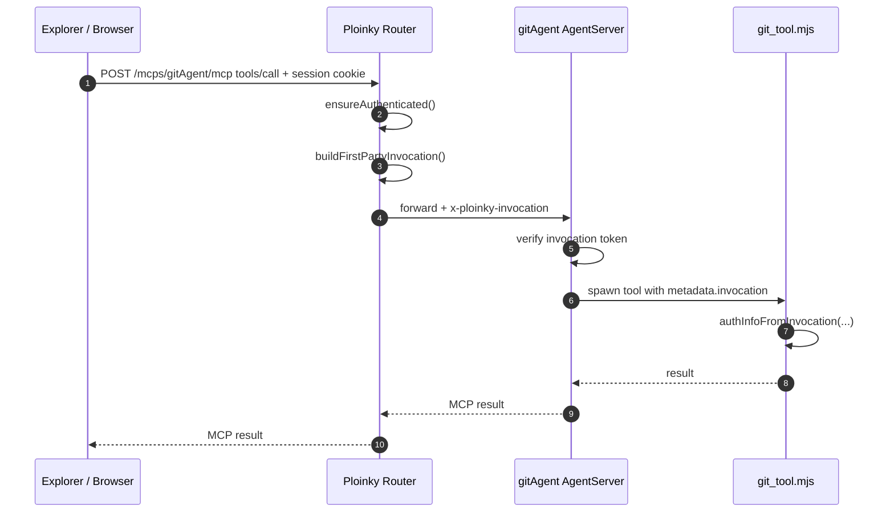
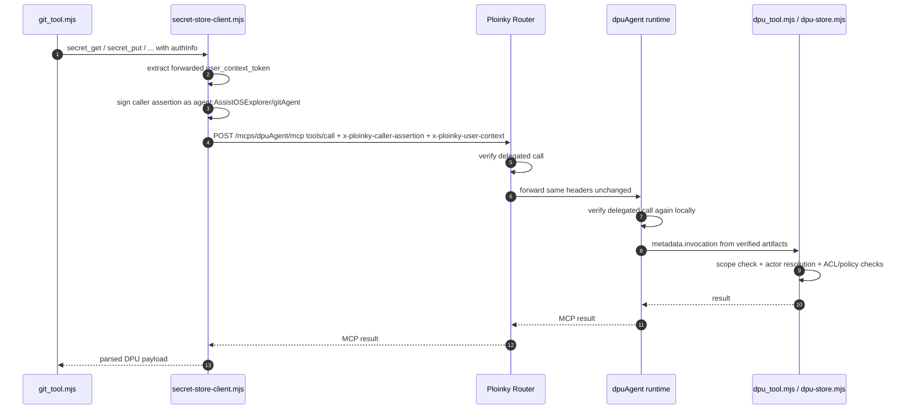

# Agent-to-Agent Communication, Authentication, and Authorization

This document describes the **current implemented behavior in code** for these parts of the workspace:

- `ploinky/` — router, auth layer, runtime, key management, and secure-wire primitives
- `AssistOSExplorer/gitAgent/` — Git MCP agent and DPU secret-store consumer
- `AssistOSExplorer/dpuAgent/` — DPU MCP agent, secret/confidential storage owner, and final authorization authority

It is intentionally code-first. Where older prose in the repository disagrees, this document follows the current implementation.

---

## 1. Executive Summary

The current system is split into three trust domains:

1. **Ploinky router authenticates the human user**
   - via local auth or SSO
   - normalizes identity onto `req.user`, `req.session`, and `req.authMode`

2. **Each agent proves its own identity cryptographically**
   - with an Ed25519-signed caller assertion
   - using a workspace-managed keypair derived from the canonical agent principal

3. **`dpuAgent` makes the final authorization decision**
   - by checking invocation scope
   - by resolving the authenticated actor
   - by applying ACLs, ownership rules, audit-role rules, and DPU-owned agent policy

For the live `gitAgent -> dpuAgent` secret flow:

- `gitAgent` does **not** request a session token from `dpuAgent`
- `gitAgent` does **not** use Ploinky capability bindings for the secret-store path
- `gitAgent` signs a per-request caller assertion and forwards the router-issued user-context token
- `dpuAgent` verifies both artifacts and then authorizes the operation

---

## 2. Canonical Principals and Identities

Ploinky derives agent identity from repository layout in `ploinky/cli/services/agentIdentity.js`.

Canonical forms:

- agent ref: `<repo>/<agent>`
- agent principal: `agent:<repo>/<agent>`

In this workspace that means:

- `gitAgent` principal: `agent:AssistOSExplorer/gitAgent`
- `dpuAgent` principal: `agent:AssistOSExplorer/dpuAgent`

Important implications:

- agents do **not** choose their own runtime identity in `manifest.json`
- short route names such as `gitAgent` and `dpuAgent` are router-facing names, not authorization principals
- DPU policy and secure-wire audience checks use the canonical principal form

The router uses:

- token issuer: `ploinky-router`
- first-party caller subject: `router:first-party`

---

## 3. Key Material and Runtime Injection

Ploinky manages the signing keys in `ploinky/cli/services/agentKeystore.js`.

### 3.1 Key storage

Router keypair:

- `.ploinky/keys/router/session.key`
- `.ploinky/keys/router/session.pub`

Agent keypairs:

- `.ploinky/keys/agents/<encoded-principal>.key`
- `.ploinky/keys/agents/<encoded-principal>.pub`

Public keys are also mirrored into workspace config through `capabilityRegistry.js` so the router and providers can resolve agent public keys quickly.

### 3.2 Runtime env injected into agents

The Docker and bwrap launchers inject the secure-wire contract into running agents in:

- `ploinky/cli/services/docker/agentServiceManager.js`
- `ploinky/cli/services/bwrap/bwrapServiceManager.js`

The important variables are:

- `PLOINKY_AGENT_PRINCIPAL`
- `PLOINKY_AGENT_PRIVATE_KEY_PATH`
- `PLOINKY_ROUTER_PUBLIC_KEY_JWK`
- `PLOINKY_AGENT_PUBLIC_KEYS_JSON`
- `PLOINKY_ROUTER_URL`
- `PLOINKY_ROUTER_HOST`
- `PLOINKY_ROUTER_PORT`
- `PLOINKY_MCP_CONFIG_PATH`
- `PLOINKY_WORKSPACE_ROOT`

For `dpuAgent`, manifest-driven runtime resources also inject:

- `DPU_DATA_ROOT`
- `DPU_WORKSPACE_ROOT`
- `DPU_MASTER_KEY`

---

## 4. Communication Surfaces

### 4.1 Browser/UI -> router -> agent MCP

Normal UI calls go to the router endpoint:

- `/mcps/<agent>/mcp`

The router-side MCP proxy lives in:

- `ploinky/cli/server/mcp-proxy/index.js`
- `ploinky/cli/server/AgentClient.js`

For standard MCP clients, the router manages MCP sessions with `mcp-session-id` and forwards `tools/list`, `tools/call`, `resources/list`, `resources/read`, and `ping` to the target agent.

### 4.2 Router -> provider agent runtime

Provider agents normally run under the generic Ploinky runtime:

- `ploinky/Agent/server/AgentServer.mjs`

That runtime reads `mcp-config.json`, receives HTTP MCP requests on `/mcp`, verifies secure-wire headers, and then spawns the configured tool command.

### 4.3 Tool subprocess boundary

When an MCP tool is executed, Ploinky passes a JSON envelope over stdin to the tool process:

```json
{
  "tool": "...",
  "input": { ... },
  "metadata": {
    "invocation": { ...verified secure-wire grant... }
  }
}
```

Relevant files:

- `ploinky/Agent/server/AgentServer.mjs`
- `ploinky/Agent/lib/toolEnvelope.mjs`
- `ploinky/Agent/lib/invocation-auth.mjs`
- `AssistOSExplorer/shared/invocation-auth.mjs`

The important rule is simple:

- **`metadata.invocation` is the trusted caller/auth context**
- tools should not invent caller or delegated-user identity outside that verified grant

### 4.4 Current `gitAgent -> dpuAgent` delegated call path

The current Git-to-DPU path is deliberately simple:

- `gitAgent` uses `AssistOSExplorer/gitAgent/lib/secret-store-client.mjs`
- it sends **one direct JSON-RPC `tools/call` POST** to `/mcps/dpuAgent/mcp`
- it does **not** do MCP session initialization
- it does **not** send `mcp-session-id`
- it does **not** use `/auth/agent-token`
- it does **not** do capability-binding lookup

This is the live delegated secret-store path.

---

## 5. Secure-Wire Artifacts

The signing and verification primitives live in:

- `ploinky/Agent/lib/wireSign.mjs`
- `ploinky/Agent/lib/wireVerify.mjs`
- `ploinky/Agent/lib/runtimeWire.mjs`
- `ploinky/cli/server/mcp-proxy/secureWire.js`

All current secure-wire tokens use:

- **JWS compact format**
- **`EdDSA` over Ed25519**
- **body binding** through `body_hash = sha256(canonicalJson({ tool, arguments }))`
- **replay protection** through `jti`
- **short TTLs** (hard max 120 seconds)

### 5.1 Router invocation token

Header:

- `x-ploinky-invocation`

Signed by:

- router

Purpose:

- represent a first-party authenticated call from router/browser context to a provider agent

Key claims:

- `iss = ploinky-router`
- `sub = router:first-party` for first-hop browser calls
- `aud = <provider principal>`
- `tool`
- `scope`
- `body_hash`
- `jti`, `iat`, `exp`
- optional delegated `user`
- optional embedded `user_context_token`

### 5.2 Agent caller assertion

Header:

- `x-ploinky-caller-assertion`

Signed by:

- caller agent

Purpose:

- prove caller-agent identity for one delegated request
- bind the request body and requested scope to that agent identity

Key claims:

- `iss = agent:<repo>/<agent>`
- `aud = <provider principal>` for direct delegated calls
- `tool`
- `scope`
- `body_hash`
- `jti`, `iat`, `exp`
- optional `binding_id`, `alias`
- optional `user_context_token`

### 5.3 User context token

Header:

- `x-ploinky-user-context`

Signed by:

- router

Purpose:

- carry the authenticated human user's identity across a delegated agent call

Key claims:

- `iss = ploinky-router`
- `aud = <immediate caller principal>`
- `sid`
- `user = { sub/id, username, email, roles }`
- `jti`, `iat`, `exp`

The audience rule is critical:

- the user token is minted **for the immediate caller agent**, not for the downstream provider
- this lets the downstream provider verify that the forwarding agent is the same agent the router trusted with that user context

---

## 6. Authentication Flow: Browser/User -> `gitAgent`

Human-user authentication is owned by the router in `ploinky/cli/server/authHandlers.js`.

Supported modes:

- local auth
- SSO
- `none` for routes explicitly configured as public

Cookies:

- local auth: `ploinky_local`
- SSO: `ploinky_sso`

After `ensureAuthenticated(...)`, the router attaches:

- `req.user`
- `req.session`
- `req.sessionId`
- `req.authMode`

### First-hop call sequence

1. Explorer/browser sends `tools/call` to `/mcps/gitAgent/mcp` with a valid session cookie.
2. The router authenticates the user.
3. The router mints a router-signed invocation token for `gitAgent`.
4. If there is a user session, the router also mints a router-signed `user_context_token` whose audience is `agent:AssistOSExplorer/gitAgent`.
5. The router forwards the MCP request to `gitAgent` with `x-ploinky-invocation`.
6. `AgentServer` in `gitAgent` verifies the invocation token.
7. `git_tool.mjs` reconstructs `authInfo` from the verified invocation grant.

In code:

- router auth: `ploinky/cli/server/authHandlers.js`
- first-party invocation minting: `ploinky/cli/server/mcp-proxy/secureWire.js`
- proxy assembly: `ploinky/cli/server/mcp-proxy/index.js`
- provider verification: `ploinky/Agent/server/AgentServer.mjs`
- grant -> authInfo: `AssistOSExplorer/gitAgent/tools/git_tool.mjs` + `AssistOSExplorer/shared/invocation-auth.mjs`

---

## 7. Delegated Flow: `gitAgent` -> `dpuAgent`

This is the most important agent-to-agent path in the current codebase.

### 7.1 Why `gitAgent` calls DPU

`gitAgent` needs DPU when GitHub/device-flow tokens are stored or retrieved:

- `git_auth_status`
- `git_auth_begin`
- `git_auth_poll`
- `git_auth_disconnect`
- `git_auth_store_token`
- `git_push` / `git_pull` token fallback

Relevant files:

- `AssistOSExplorer/gitAgent/lib/github-auth.mjs`
- `AssistOSExplorer/gitAgent/lib/secret-store-client.mjs`
- `AssistOSExplorer/gitAgent/tools/git_tool.mjs`

### 7.2 Current delegated sequence

1. `gitAgent` receives a verified first-hop invocation from the router.
2. `git_tool.mjs` extracts `authInfo.invocation.userContextToken`.
3. `secret-store-client.mjs` resolves:
   - router URL
   - caller principal (`PLOINKY_AGENT_PRINCIPAL`)
   - DPU route name (default `dpuAgent`)
   - DPU principal (default `agent:AssistOSExplorer/dpuAgent`)
4. `gitAgent` loads its private key.
5. `gitAgent` signs a fresh caller assertion for the exact DPU operation and arguments.
6. `gitAgent` forwards the router-issued user-context token unchanged.
7. `gitAgent` POSTs one JSON-RPC `tools/call` request to `/mcps/dpuAgent/mcp`.
8. The router verifies the delegated request before forwarding it.
9. `dpuAgent` verifies the same secure-wire artifacts again locally.
10. `dpu_tool.mjs` converts the verified invocation into `authInfo`.
11. `dpu-store.mjs` applies scope checks, actor resolution, ACL checks, and policy checks.

### 7.3 Headers used on the delegated hop

`gitAgent` sends:

- `x-ploinky-caller-assertion`
- `x-ploinky-user-context`

It does **not** send:

- `x-ploinky-invocation`
- `mcp-session-id`
- bearer agent credentials

### 7.4 Scope contract used by `gitAgent`

`AssistOSExplorer/gitAgent/lib/secret-store-client.mjs` maps operations to scopes as follows:

| DPU operation   | Scope carried in caller assertion |
| --- | --- |
| `secret_get`    | `secret:read`   |
| `secret_list`   | `secret:read`   |
| `secret_put`    | `secret:write`  |
| `secret_delete` | `secret:write`  |
| `secret_grant`  | `secret:grant`  |
| `secret_revoke` | `secret:revoke` |

---

## 8. What the Router Verifies on Delegated Agent Calls

The delegated verification logic is in:

- `ploinky/cli/server/mcp-proxy/index.js`
- `ploinky/cli/server/mcp-proxy/secureWire.js`

For delegated agent calls, the router requires:

- both `x-ploinky-caller-assertion` and `x-ploinky-user-context`
- request shape = direct JSON-RPC `tools/call`

The router then verifies:

1. **caller assertion signature**
   - using the registered public key for `iss`
2. **caller assertion audience**
   - must equal the target provider principal
3. **caller assertion body hash**
   - must match `{ tool, arguments }`
4. **caller assertion replay / freshness**
   - `jti`, `iat`, `exp`
5. **forwarded user token signature**
   - must verify with router public key
6. **forwarded user token audience**
   - must equal the caller assertion issuer
7. **embedded vs forwarded user token consistency**
   - if the assertion embeds a `user_context_token`, it must match the header value

If verification succeeds, the router forwards the same headers to the provider. It does **not** downgrade the provider's responsibility to verify locally.

---

## 9. What the Provider Verifies Locally

### 9.1 Generic AgentServer path

Under the normal Ploinky runtime, provider verification happens in:

- `ploinky/Agent/server/AgentServer.mjs`
- `ploinky/Agent/lib/runtimeWire.mjs`

For each tool call, `AgentServer` checks either:

- `x-ploinky-invocation` for first-party routed calls, or
- `x-ploinky-caller-assertion` + `x-ploinky-user-context` for direct delegated calls

On success it injects a verified `metadata.invocation` grant into the tool envelope.

### 9.2 `dpuAgent` standalone path

`dpuAgent` also ships a standalone MCP runtime in:

- `AssistOSExplorer/dpuAgent/server/standalone-mcp-server.mjs`

That server re-implements the same verification model:

- first-party invocation-token verification
- direct caller-assertion + user-context verification
- conversion into the same tool-envelope structure

So the DPU authorization model is consistent whether it runs under generic `AgentServer` or the standalone DPU MCP server.

---

## 10. DPU Authentication and Authorization Model

`dpuAgent` is the **final authority** for secrets, confidential objects, audit access, and agent policy.

Core files:

- `AssistOSExplorer/dpuAgent/tools/dpu_tool.mjs`
- `AssistOSExplorer/dpuAgent/lib/dpu-store.mjs`
- `AssistOSExplorer/dpuAgent/lib/dpu-store-internal/identity-acl.mjs`
- `AssistOSExplorer/dpuAgent/lib/dpu-store-internal/permissions-manifest.mjs`
- `AssistOSExplorer/dpuAgent/lib/dpu-store-internal/storage.mjs`

### 10.1 Step 1: invocation scope enforcement

`dpu-store.mjs` first enforces operation scope using `authInfo.invocation.scope`.

Examples from `OPERATION_SCOPE_MAP`:

- `secret_get` -> `secret:read`
- `secret_put` -> `secret:write`
- `secret_grant` -> `secret:grant` or `secret:write`
- `secret_revoke` -> `secret:revoke` or `secret:write`
- `secret_list` -> `secret:access` or `secret:read`

This is **contract-level authorization**. It prevents an agent from using a token minted for one operation class to execute a stronger operation.

### 10.2 Step 2: authenticated actor resolution

After scope verification, DPU resolves the actor from verified `authInfo`.

Important behavior from `identity-acl.mjs` and `permissions-manifest.mjs`:

- primary ownership/user-space resolution is normally anchored to the authenticated **user** principal
- ACL evaluation can match multiple principal candidates, including:
  - resolved user principal
  - agent principal
  - email
  - raw user id / username aliases
  - `user:<id>`
  - `user:<username>`
  - `sso:<subject>`

This means DPU can authorize a request based on the delegated human user, the calling agent principal, or both, depending on the ACL entries present.

### 10.3 Step 3: resource authorization

#### Secret roles

Secret roles are ordered as:

- `access`
- `write-access`
- `read`
- `write`

Practical meaning:

| Role | Can inspect existence/metadata | Can read plaintext | Can update value |
| --- | --- | --- | --- |
| `access` | yes | no  | no  |
| `write-access` | yes | no  | yes |
| `read` | yes | yes | no  |
| `write` | yes | yes | yes |

Important nuance:

- secret owners are effectively treated as `write-access` by ownership
- that means an owner can update the value and manage ACLs without automatically materializing plaintext
- `getSecretByKey()` may therefore return a secret record without plaintext value if the resolved role allows `access` but not `read`

#### Confidential-object roles

Confidential roles are ordered as:

- `access`
- `read`
- `comment`
- `write`

Authorization is inherited through ancestor traversal, and owners effectively get `write`.

### 10.4 Step 4: admin/security-only operations

DPU restricts audit operations to trusted actors:

- local `admin`
- or actors with role `admin`
- or actors with role `security`

That affects:

- `dpu_audit_config_get`
- `dpu_audit_config_set`
- `dpu_audit_list`
- `dpu_audit_get`
- `/Confidential/Audit` visibility

### 10.5 Step 5: agent-policy enforcement for secret grants

This is a crucial part of the current design.

When DPU grants a secret role to an **agent principal**, it checks DPU-owned policy in:

- `.dpu-storage/permissions.manifest.json`
- `agentPolicies[<principalId>].secrets.allowedRoles`

Management tools:

- `dpu_agent_policy_get`
- `dpu_agent_policy_set`

Enforcement behavior:

- if the grantee principal starts with `agent:`
- and no DPU policy exists for that principal
- the grant is rejected
- if a policy exists but the requested role is not in `allowedRoles`, the grant is also rejected

This means:

- **agent secret-role ceilings are controlled by DPU policy, not by agent manifests**
- current code does **not** consult `gitAgent` or `dpuAgent` manifests when deciding what secret role an agent may receive

---

## 11. Capability Registry vs the Live Git/DPU Path

Ploinky still contains a general capability system in:

- `ploinky/cli/services/capabilityRegistry.js`

That system supports:

- manifest `provides`
- manifest `requires`
- workspace capability bindings
- scope intersection between consumer, binding, and provider

However, the current `gitAgent -> dpuAgent` secret flow intentionally bypasses that layer:

- `gitAgent/manifest.json` has no live `requires.secretStore` block
- `secret-store-client.mjs` directly targets DPU by route/principal
- `gitAgent` signs and sends direct delegated requests itself
- DPU authorization is handled through secure-wire verification + DPU ACL/policy, not capability-binding resolution

So the capability registry is part of Ploinky's general architecture, but **it is not the active control plane for the Git-to-DPU secret-store path**.

---

## 12. Storage Ownership in DPU

`dpuAgent` stores its state under `DPU_DATA_ROOT` using `storage.mjs`.

Important files/directories:

- `state.json` — users, secret metadata, confidential metadata, settings
- `permissions.manifest.json` — identities, ACL entries, agent policies
- `secrets.json` — encrypted secret values
- `blobs/` — encrypted confidential file content
- `audit/` — audit JSONL files
- `.lock/` — single-writer coordination

So storage ownership is explicit:

- `gitAgent` never owns secret persistence
- `gitAgent` only requests secret operations
- `dpuAgent` owns storage, ACLs, policy, encryption, and audit logging

---

## 13. Legacy Paths That Are No Longer the Active Model

There are older/legacy traces in the repo that are not the live Git/DPU trust path anymore.

### 13.1 `/auth/agent-token` is removed

In `ploinky/cli/server/authHandlers.js`:

- `/auth/agent-token` returns HTTP `410`
- callers are explicitly told to use secure-wire caller assertions and invocation tokens instead

### 13.2 Bearer-style agent auth is removed

`ensureAgentAuthenticated(...)` in `authHandlers.js` now returns an error pointing callers to secure-wire signed requests.

### 13.3 `AgentMcpClient.mjs` is not the current Git->DPU path

`ploinky/Agent/client/AgentMcpClient.mjs` still contains an OAuth-style agent-token flow, but that path depends on the removed `/auth/agent-token` endpoint.

The active Git/DPU path is instead:

- `AssistOSExplorer/gitAgent/lib/secret-store-client.mjs`
- direct signed `tools/call`
- no MCP session setup
- no bearer agent token

---

## 14. End-to-End Sequence Diagrams

### 14.1 Browser -> router -> `gitAgent`



### 14.2 `gitAgent` -> router -> `dpuAgent`



---

## 15. Where the Important Logic Lives

| Concern | Main files |
| --- | --- |
| Principal derivation | `ploinky/cli/services/agentIdentity.js` |
| Agent/router key management | `ploinky/cli/services/agentKeystore.js` |
| Registered public keys / capability registry | `ploinky/cli/services/capabilityRegistry.js` |
| Router auth for humans | `ploinky/cli/server/authHandlers.js` |
| Router MCP proxy | `ploinky/cli/server/mcp-proxy/index.js` |
| Router secure-wire mint/verify | `ploinky/cli/server/mcp-proxy/secureWire.js` |
| Generic provider runtime verification | `ploinky/Agent/server/AgentServer.mjs`, `ploinky/Agent/lib/runtimeWire.mjs` |
| Token sign/verify primitives | `ploinky/Agent/lib/wireSign.mjs`, `ploinky/Agent/lib/wireVerify.mjs` |
| Tool-envelope auth handoff | `ploinky/Agent/lib/toolEnvelope.mjs`, `ploinky/Agent/lib/invocation-auth.mjs` |
| `gitAgent` delegated DPU client | `AssistOSExplorer/gitAgent/lib/secret-store-client.mjs` |
| `gitAgent` GitHub auth lifecycle | `AssistOSExplorer/gitAgent/lib/github-auth.mjs` |
| `gitAgent` tool entrypoint | `AssistOSExplorer/gitAgent/tools/git_tool.mjs` |
| `dpuAgent` tool entrypoint | `AssistOSExplorer/dpuAgent/tools/dpu_tool.mjs` |
| `dpuAgent` authorization and domain logic | `AssistOSExplorer/dpuAgent/lib/dpu-store.mjs` |
| DPU actor / ACL logic | `AssistOSExplorer/dpuAgent/lib/dpu-store-internal/identity-acl.mjs` |
| DPU identities / ACL manifest / agent policy | `AssistOSExplorer/dpuAgent/lib/dpu-store-internal/permissions-manifest.mjs` |
| DPU encrypted storage | `AssistOSExplorer/dpuAgent/lib/dpu-store-internal/storage.mjs` |
| Standalone DPU MCP runtime | `AssistOSExplorer/dpuAgent/server/standalone-mcp-server.mjs` |

---

## 16. Final Takeaways

The current code implements these high-level rules:

- **Ploinky authenticates the human user**
- **agents authenticate themselves with Ed25519 caller assertions**
- **the router carries user identity forward with a router-signed user-context token**
- **providers verify secure-wire artifacts locally, even after router verification**
- **`gitAgent` is a DPU client, not a secret owner**
- **`dpuAgent` is the final authorization authority for secret/confidential operations**
- **agent secret-role ceilings are controlled by DPU-owned policy in `permissions.manifest.json`**
- **the live Git/DPU path uses direct secure-wire JSON-RPC calls, not capability bindings and not bearer agent tokens**

