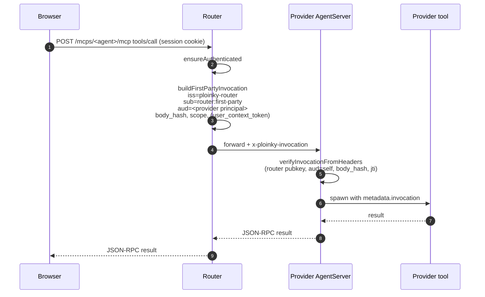
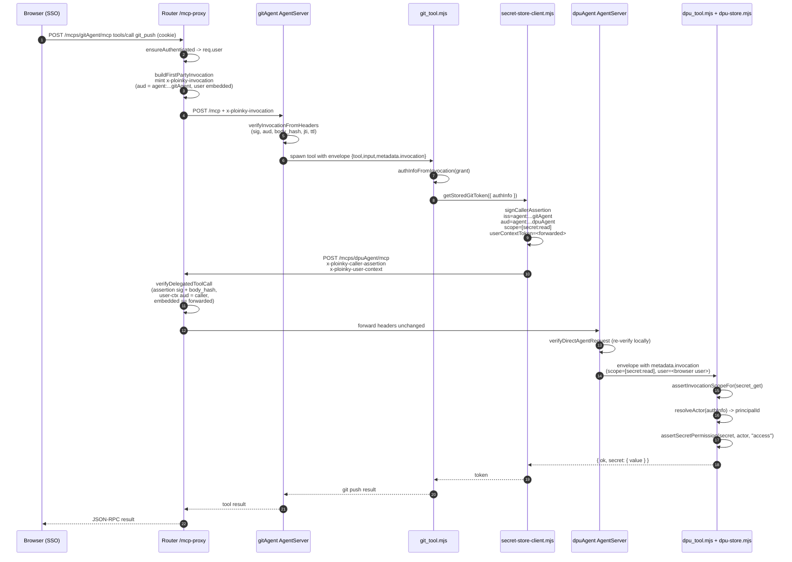

# Agent-to-Agent Communication, Authentication, and Authorization

Scope: this document describes the communication, authentication, and
authorization model implemented by:

- `ploinky/` — the Ploinky router, agent runtime, keystore, capability registry
  and secure-wire primitives.
- `AssistOSExplorer/gitAgent/` — a Git-focused provider agent that also acts as
  a consumer of the DPU secret store.
- `AssistOSExplorer/dpuAgent/` — the Data Protection Unit agent that owns
  secrets, confidential objects, identity/ACL state, and agent policies.

All statements below are grounded in the source as it exists on this branch.
File and line references use the form `path:line`.

---

## 1. Components and Principals

### 1.1 Principal identifiers

Agent identity is deterministic and derived from the repository layout:

- `deriveAgentRef(repo, agent) = "<repo>/<agent>"`
  (`ploinky/cli/services/agentIdentity.js:12`)
- `deriveAgentPrincipalId(repo, agent) = "agent:<repo>/<agent>"`
  (`ploinky/cli/services/agentIdentity.js:18`)

So `gitAgent` under `AssistOSExplorer` has principal id
`agent:AssistOSExplorer/gitAgent`, and the DPU has
`agent:AssistOSExplorer/dpuAgent` (used as the default provider principal in
`AssistOSExplorer/gitAgent/lib/secret-store-client.mjs:45`).

The router uses a reserved principal `router:first-party` for router-originated
(browser/UI) calls (`ploinky/cli/server/mcp-proxy/secureWire.js:147`) and the
issuer claim `ploinky-router` on signed tokens
(`ploinky/cli/server/mcp-proxy/secureWire.js:23`).

### 1.2 Keys

Per-agent Ed25519 keypairs and a router session key are managed by
`ploinky/cli/services/agentKeystore.js`:

- Router session keys: `<workspace>/.ploinky/keys/router/session.{key,pub}`
  (`ploinky/cli/services/agentKeystore.js:29-30`, functions
  `ensureRouterSigningKey`, `getRouterPublicKey`, `rotateRouterSigningKey`).
- Agent keys: `<workspace>/.ploinky/keys/agents/<encoded principal>.{key,pub}`
  (`ploinky/cli/services/agentKeystore.js:71-77`, functions
  `ensureAgentKeypair`, `rotateAgentKeypair`, `loadAgentPrivateKey`,
  `loadAgentPublicKey`).
- Public keys are additionally mirrored into the workspace config under
  `_config.capabilityAgentKeys` via
  `registerAgentPublicKey` /`listRegisteredAgentPublicKeys`
  (`ploinky/cli/services/capabilityRegistry.js:530`, `:510`).

Private-key files are `0600` and directories `0700`
(`ploinky/cli/services/agentKeystore.js:32-68`).

### 1.3 Capability manifests

Each agent manifest may declare what it provides and what it consumes. The
registry normalizes them into descriptors:

- `provides[<contract>] = { contract, operations, supportedScopes }`
- `requires[<alias>]   = { alias, contract, maxScopes, optional }`

See `ploinky/cli/services/capabilityRegistry.js:86-119`,
`buildAgentDescriptor` at `:152`, `buildCapabilityIndex` at `:217`.

Workspace-local capability bindings (`consumer:alias -> provider, contract,
approvedScopes`) are stored in the agents config under key
`capabilityBindings` (`ploinky/cli/services/capabilityRegistry.js:27`,
`setCapabilityBinding` at `:317`, `resolveAliasForConsumer` at `:371`).

Scope granting is the intersection
`requested ∩ consumer.maxScopes ∩ binding.approvedScopes ∩ provider.supportedScopes`
(`ploinky/cli/services/capabilityRegistry.js:400-411`).

---

## 2. Transport and Envelope

### 2.1 Router-mediated MCP over HTTP

Every agent call goes through the router to an agent-specific MCP endpoint:

- Client helper: `createAgentClient(agentName)` in
  `ploinky/Agent/client/AgentMcpClient.mjs:107` computes
  `${routerUrl}/mcps/${agentName}/mcp` from `PLOINKY_ROUTER_URL` /
  `PLOINKY_ROUTER_PORT`.
- Router proxy: `ploinky/cli/server/mcp-proxy/index.js:256` handles POST to
  `/mcps/<agent>/mcp`, forwards to the agent's container-local MCP server and
  multiplexes JSON-RPC sessions.

Each provider agent runs an MCP server (`ploinky/Agent/server/AgentServer.mjs`)
that exposes `tools/list`, `tools/call`, `resources/list`, `resources/read`,
`ping` at `POST /mcp` on port `7000` (or `PORT`)
(`ploinky/Agent/server/AgentServer.mjs:597,623`).

### 2.2 Tool envelope into the container tool

Tools are invoked as subprocesses by `AgentServer`. The server builds a JSON
envelope and pipes it into the tool over stdin:

```js
const payload = { tool: name, input: args, metadata: context };
// metadata.invocation = <verified router grant>
```

(`ploinky/Agent/server/AgentServer.mjs:443`).

On the tool side, `toolEnvelope.mjs` normalizes this envelope and exposes a
derived actor via `deriveActor(envelope)`
(`ploinky/Agent/lib/toolEnvelope.mjs:102-168`). The tool is forbidden from
inventing caller or delegated-user fields that were not present in
`metadata.invocation` (see the module header at `:1`).

### 2.3 Wire headers

Three HTTP headers carry signed claims
(`ploinky/Agent/lib/runtimeWire.mjs:9-11`, mirrored at
`ploinky/cli/server/mcp-proxy/index.js:13-15`):

| Header                       | Semantics                                           |
| ---------------------------- | --------------------------------------------------- |
| `x-ploinky-invocation`       | Router-minted invocation token (router -> provider) |
| `x-ploinky-caller-assertion` | Agent-minted caller assertion (agent -> router/provider) |
| `x-ploinky-user-context`     | Router-minted user context token, audience = caller |

---

## 3. Secure-Wire Tokens

All tokens are compact JWS using `EdDSA` over Ed25519. Common primitives:

- `signRouterToken`, `signCallerAssertion`, `bodyHashForRequest`,
  `canonicalJson` in `ploinky/Agent/lib/wireSign.mjs`.
- `verifyJws`, `verifyCallerAssertion`, `verifyInvocationToken`,
  `createMemoryReplayCache`, `MAX_TTL_SECONDS = 120` in
  `ploinky/Agent/lib/wireVerify.mjs`.

Body binding: every token carries
`body_hash = sha256(canonicalJson({ tool, arguments }))`, so tampering with
arguments invalidates the signature
(`ploinky/Agent/lib/wireSign.mjs:53-56`,
`ploinky/Agent/lib/wireVerify.mjs:104-109`).

Replay protection: every token carries a random `jti`. Verifiers inject a
`replayCache` (`createMemoryReplayCache`) so a `jti` can only be consumed once
within its lifetime (`ploinky/Agent/lib/wireVerify.mjs:112-127`,
`225-249`).

### 3.1 Caller assertion (agent-signed)

Shape (`ploinky/Agent/lib/wireSign.mjs:90-108`):

```
iss:   agent:<repo>/<name>       # caller's principal
aud:   ploinky-router | <provider principal>   # router or direct-to-provider
iat, exp (exp - iat <= 60s, enforced max 120s)
jti:   random
tool:  "<tool-name>"
scope: ["secret:read", ...]
body_hash: <sha256(canonical body)>
binding_id?, alias?, user_context_token?
```

Signed with the agent's Ed25519 private key
(`ploinky/Agent/lib/wireSign.mjs:116`), verified with the public key looked up
by the verifier via a `resolveCallerPublicKey(iss)` callback
(`ploinky/Agent/lib/wireVerify.mjs:167-193`).

### 3.2 Router invocation token (`x-ploinky-invocation`)

Minted by the router for first-party (browser/UI) calls
(`ploinky/cli/server/mcp-proxy/secureWire.js:124-161`) with shape:

```
iss: "ploinky-router"
sub: "router:first-party"             # or an agent principal if delegated
aud: <provider principal>
workspace_id, binding_id, contract, scope, tool
body_hash, jti, iat, exp (default 60s, max 120s)
user, user_context_token  (optional)
```

Signed with the router session key, verified by each provider against the
router's public key (`ploinky/Agent/lib/runtimeWire.mjs:40-65`,
`ploinky/Agent/lib/wireVerify.mjs:201-219`).

### 3.3 User context token (`x-ploinky-user-context`)

Minted by the router from the browser session to propagate the authenticated
user's identity into a downstream call
(`ploinky/cli/server/mcp-proxy/secureWire.js:54-72`):

```
iss: "ploinky-router"
aud: <caller principal>    # note: audience is the AGENT, not the provider
sid: <router session id>
iat, exp (60s), jti
user: { sub, id, email, username, roles }
```

The audience being the *caller* is how the provider can cross-check that the
user token forwarded to it was actually issued for the agent that now claims
to be delegating (see verification in
`ploinky/cli/server/mcp-proxy/secureWire.js:206-210` and
`ploinky/Agent/lib/runtimeWire.mjs:164-168`).

---

## 4. Two Call Patterns

There are two supported call patterns between principals. Provider agents
accept only these; anything else is rejected.

### 4.1 Pattern A — Router-mediated first-party call

Used when the browser/UI, authenticated via SSO or local auth, calls an agent
through the router.

1. Browser sends JSON-RPC `tools/call` to `/mcps/<agent>/mcp` with an
   authenticated session cookie (`ploinky_sso` or `ploinky_local`).
2. Router proxy runs `ensureAuthenticated` if auth context isn't already
   attached (`ploinky/cli/server/mcp-proxy/index.js:370-375`,
   `ploinky/cli/server/authHandlers.js:678`).
3. Router calls `buildFirstPartyInvocation` to mint an invocation token
   (`ploinky/cli/server/mcp-proxy/secureWire.js:124`). Caller principal is
   `router:first-party`, audience is the provider's principal. If the session
   has a user, a `user_context_token` (audience = router first-party, i.e. the
   caller) is also issued and embedded.
4. Router attaches `x-ploinky-invocation: <token>` on the outbound request
   (`ploinky/cli/server/mcp-proxy/index.js:183`).
5. Provider's `AgentServer` calls `verifyInvocationFromHeaders` before it
   exposes the grant to the tool
   (`ploinky/Agent/server/AgentServer.mjs:421-440`,
   `ploinky/Agent/lib/runtimeWire.mjs:101-126`). On failure it returns a
   JSON-RPC `InvalidRequest` error.
6. The verified grant is injected as `metadata.invocation` of the tool
   envelope (`ploinky/Agent/server/AgentServer.mjs:435,443`).



### 4.2 Pattern B — Delegated direct agent call

Used when one agent calls another on behalf of a user whose session is owned
by the router (e.g. `gitAgent` calling `dpuAgent` to fetch `GIT_GITHUB_TOKEN`).
No capability binding is required for this flow — the provider enforces
identity and scope directly.

1. Caller agent builds the canonical body object
   `{ tool, arguments }` and calls `signCallerAssertion`
   (`ploinky/Agent/lib/wireSign.mjs:69`) with:
   - `callerPrincipal = PLOINKY_AGENT_PRINCIPAL`
   - `audience = <provider principal>` (not `ploinky-router`)
   - `scope = [...]`
   - `userContextToken = <token it received from the router>`
2. Caller sends a POST to `/mcps/<provider>/mcp` with:
   - `x-ploinky-caller-assertion: <signed JWS>`
   - `x-ploinky-user-context: <forwarded token>`
3. Router proxy recognizes the direct-agent headers
   (`ploinky/cli/server/mcp-proxy/index.js:258-262`), refuses anything other
   than `tools/call` (`:322-336`), requires both headers
   (`:301-321`), and calls `verifyDelegatedToolCall`
   (`ploinky/cli/server/mcp-proxy/secureWire.js:167`):
   - Verifies caller assertion signature using the key registered for `iss`
     via `listRegisteredAgentPublicKeys`
     (`ploinky/cli/server/mcp-proxy/secureWire.js:182-191`).
   - Verifies `expectedAudience = <provider principal>` and `body_hash`.
   - Verifies the forwarded user context token with the router's public key
     and `expectedAudience = callerPrincipal`
     (`ploinky/cli/server/mcp-proxy/secureWire.js:206-210`).
   - Cross-checks that any `user_context_token` embedded in the assertion
     matches the forwarded one (`:192-199`).
4. On success the proxy sets `req.delegatedAgentVerified = true` and forwards
   the request with the same two headers untouched
   (`ploinky/cli/server/mcp-proxy/index.js:354-366` and `:89-92`).
5. Provider's `AgentServer` detects direct-agent headers via
   `hasDirectAgentHeaders` and runs `verifyDirectAgentRequest` itself
   (`ploinky/Agent/server/AgentServer.mjs:420-440`,
   `ploinky/Agent/lib/runtimeWire.mjs:128-180`). It constructs an in-memory
   "invocation payload" from the verified assertion and user context
   (`buildDirectInvocationPayload` at `:78-99`) and exposes it to the tool as
   `metadata.invocation` with `iss = "direct-agent-wire"`.

Because the provider re-verifies locally, trust is not transitively dependent
on the proxy: the proxy only gates access; the provider still requires the
correct signatures. Replay caches are independent per process
(`ploinky/Agent/server/AgentServer.mjs:22-23`,
`ploinky/cli/server/mcp-proxy/secureWire.js:25`).

### 4.3 What the router refuses

- Browser MCP calls without a session, unless the target route's auth mode is
  `none` (`ploinky/cli/server/authHandlers.js:680-722`).
- Any request carrying only one of `x-ploinky-caller-assertion` /
  `x-ploinky-user-context` — both are mandatory together
  (`ploinky/cli/server/mcp-proxy/index.js:300-321`).
- Any delegated-agent request other than `tools/call`
  (`ploinky/cli/server/mcp-proxy/index.js:322-336`).
- The legacy `/auth/agent-token` OAuth-client-credentials flow returns HTTP
  410 (`ploinky/cli/server/authHandlers.js:1129-1141`). The
  `AgentMcpClient.getAgentAccessToken` helper in
  `ploinky/Agent/client/AgentMcpClient.mjs:39` that targeted that endpoint is
  a legacy path and is not exercised by the current secure-wire flow.

---

## 5. gitAgent as Caller: How It Calls dpuAgent

`gitAgent` needs to read/write a user's GitHub token for push/pull. It never
stores secrets itself; it delegates to `dpuAgent` via the secure wire.

### 5.1 Client setup

`AssistOSExplorer/gitAgent/lib/secret-store-client.mjs` declares the direct
Git -> DPU client:

- Defaults: `PLOINKY_DPU_ROUTE = "dpuAgent"`,
  `PLOINKY_DPU_PRINCIPAL = "agent:AssistOSExplorer/dpuAgent"`
  (`secret-store-client.mjs:44-45`).
- Required env: `PLOINKY_ROUTER_URL` (or host/port),
  `PLOINKY_AGENT_PRINCIPAL`, and either `PLOINKY_AGENT_PRIVATE_KEY_PEM` or
  `PLOINKY_AGENT_PRIVATE_KEY_PATH`. Falls back to looking up
  `.ploinky/keys/agents/<principal>.key` under a workspace root
  (`secret-store-client.mjs:51-67`).
- Target URL: `${routerBase}/mcps/<encoded DPU route>/mcp`
  (`secret-store-client.mjs:151`).

### 5.2 Per-call protocol

For each secret operation (`secret_get`, `secret_put`, `secret_delete`,
`secret_grant`, `secret_revoke`, `secret_list`):

1. Build body `{ tool: operation, arguments }`
   (`secret-store-client.mjs:154`).
2. Require a delegated user context token. It is sourced, in order:
   - explicit `userContextToken` arg
   - `authInfo.invocation.userContextToken` (the grant injected into the tool
     that is calling this client — see
     `ploinky/Agent/lib/invocation-auth.mjs:19-25`)
   - `process.env.PLOINKY_USER_CONTEXT_TOKEN`
   If none is available, the call is refused with
   `secret-store-client: missing delegated user context token.`
   (`secret-store-client.mjs:160-165`).
3. Sign a per-request caller assertion with `signCallerAssertion` targeting
   the DPU principal and the operation-specific scope. The helper
   `scopesForOperation` maps the operation to a scope
   (`secret-store-client.mjs:129-144`):

   | Operation        | Scope           |
   | ---------------- | --------------- |
   | `secret_get`     | `secret:read`   |
   | `secret_list`    | `secret:read`   |
   | `secret_put`     | `secret:write`  |
   | `secret_delete`  | `secret:write`  |
   | `secret_grant`   | `secret:grant`  |
   | `secret_revoke`  | `secret:revoke` |

4. POST JSON-RPC `tools/call` with both headers
   (`x-ploinky-caller-assertion`, `x-ploinky-user-context`). Parse the
   standard MCP tool response format
   (`unwrapToolPayload` at `:103-127`).

### 5.3 GitHub token lifecycle built on it

`AssistOSExplorer/gitAgent/lib/github-auth.mjs` uses four helpers exported by
the secret client:

- `getStoredGitToken({ authInfo })` -> `secret_get`
- `putStoredGitToken({ authInfo, token })` -> `secret_put`, then
  best-effort `secret_grant` (read) back to the calling agent so the agent
  itself can later read its own-owned secret on behalf of the user
  (`secret-store-client.mjs:262-264`).
- `deleteStoredGitToken`, `grantStoredGitTokenAccess` -> `secret_delete` /
  `secret_grant`.

The `git_push` / `git_pull` tools fill a missing `token` from
`authInfo.github.accessToken` (in the same grant) or from the DPU-stored
token before calling out to Git
(`AssistOSExplorer/gitAgent/tools/git_tool.mjs:270-280`).

---

## 6. dpuAgent as Provider: Authorization Layers

The DPU applies three independent layers before honoring an operation. All
three must pass.

### 6.1 Wire verification (handled by AgentServer)

Before the tool function even runs, the agent-server has already verified the
JWS and extracted the grant. If the grant is malformed or fails
signature/time/body/replay checks, the MCP call errors out
(`ploinky/Agent/server/AgentServer.mjs:421-440`). Tools therefore receive only
a grant that has passed:

- correct EdDSA signature,
- audience = this DPU's principal,
- `iat/exp` within `MAX_TTL_SECONDS`,
- `body_hash` matches the exact `{tool, arguments}` being executed,
- unique `jti` (replay-protected).

### 6.2 Invocation scope (tool-level)

`dpuAgent/lib/dpu-store.mjs` enforces operation scopes from the caller
assertion:

- `OPERATION_SCOPE_MAP` maps each op to required scope strings
  (`dpu-store.mjs:63-72`). Example: `secret_get` requires `secret:read`.
- `assertInvocationScopeFor(operation, authInfo)` reads
  `authInfo.invocation.scope` and enforces a set-membership check
  (`dpu-store.mjs:81-90`).
- If no invocation context is present (legacy / test path), the check falls
  through (`:83` comment). In production the wire layer ensures invocation is
  always present for Pattern B.

This ensures an agent that signs `secret:read` can't use the same token to
mutate state: scope narrows what the caller claimed to be doing.

### 6.3 Identity-aware ACL (resource-level)

The actor is derived from the grant via `authInfoFromInvocation`
(`ploinky/Agent/lib/invocation-auth.mjs:1-27`) into a
`{ agent, user, invocation }` shape, then resolved by
`resolveActor(authInfo, permissionsManifest)`
(`AssistOSExplorer/dpuAgent/lib/dpu-store-internal/identity-acl.mjs:107-133`
and `permissions-manifest.mjs:428-454`). The principal identifier is, in
priority order:

1. a principal referenced by manifest aliases (email, userId, username,
   ssoSubject+issuer),
2. otherwise the user email,
3. otherwise `user:<id>` / `user:<username>` / `sso:<sub>`,
4. otherwise the calling agent's own principal (`hints.agentPrincipalId`).

Permission enforcement for a secret
(`AssistOSExplorer/dpuAgent/lib/dpu-store.mjs:404-410`,
`identity-acl.mjs:39-52`):

- Secret roles: `access < write-access < read < write`
  (`identity-acl.mjs:13`).
- `write-access` can `write` but not `read` (special case at
  `identity-acl.mjs:43-50`).
- Only the secret's owner can change the ACL (`dpu-store.mjs:1035`).

For confidential objects the role order is
`access < read < comment < write` and the role is the max of:
owner => `write`, plus any ACL entry on the object or its ancestors
(`dpu-store.mjs:383-402`, `identity-acl.mjs:14`).

### 6.4 Agent-specific policy for secrets

`dpuAgent` enforces a workspace-level admin policy that controls which secret
roles may be granted *to an agent principal* at all:

- Admin tools: `dpu_agent_policy_get`, `dpu_agent_policy_set`
  (`AssistOSExplorer/dpuAgent/mcp-config.json:559-594`).
- Storage: `manifest.agentPolicies[<agent principal>].secrets.allowedRoles`
  (`permissions-manifest.mjs:166-213`).
- Enforcement: `assertAgentSecretGrantAllowed` runs inside `grantSecret` — if
  the grantee principal starts with `agent:`, a DPU policy must exist and
  must list the requested role
  (`dpu-store.mjs:412-428` and `:1046`).

This means, even if `gitAgent` asks to grant itself `read` on a secret, the
DPU refuses unless the workspace admin has pre-approved `read` in
`agentPolicies["agent:AssistOSExplorer/gitAgent"]`.

---

## 7. End-to-End: User reads a GitHub Token

The full path for `git_push` needing a GitHub token is shown below. Pattern A
(browser -> gitAgent) is stacked on top of Pattern B (gitAgent -> dpuAgent).



The critical invariant: the DPU sees *both* (a) the calling agent's signed
intent (iss + scope + body_hash) and (b) the router's proof of which user is
on the far end (user context token whose audience is the caller). Neither
half can be forged by the other.

The critical invariant: the provider sees *both* (a) the calling agent's
signed intent (iss + scope + body_hash) and (b) the router's proof of which
user is on the far end (user context token, audience = caller). Neither
half can be forged by the other — the router cannot lie about which agent
signed, the agent cannot lie about which user it claims to speak for.

---

## 8. What Lives Where (quick reference)

| Concern                            | File                                                   |
| ---------------------------------- | ------------------------------------------------------ |
| Principal derivation               | `ploinky/cli/services/agentIdentity.js`                |
| Keypair management                 | `ploinky/cli/services/agentKeystore.js`                |
| Capability manifests & bindings    | `ploinky/cli/services/capabilityRegistry.js`           |
| JWS sign / body hash / canonical   | `ploinky/Agent/lib/wireSign.mjs`                       |
| JWS verify / replay / audience     | `ploinky/Agent/lib/wireVerify.mjs`                     |
| Runtime header helpers             | `ploinky/Agent/lib/runtimeWire.mjs`                    |
| Envelope + actor derivation        | `ploinky/Agent/lib/toolEnvelope.mjs`                   |
| Grant -> authInfo adapter          | `ploinky/Agent/lib/invocation-auth.mjs`                |
| Provider MCP server                | `ploinky/Agent/server/AgentServer.mjs`                 |
| Router secure-wire mint & verify   | `ploinky/cli/server/mcp-proxy/secureWire.js`           |
| Router MCP proxy (per-agent route) | `ploinky/cli/server/mcp-proxy/index.js`                |
| Browser auth (SSO, local)          | `ploinky/cli/server/authHandlers.js`                   |
| gitAgent tools + tool router       | `AssistOSExplorer/gitAgent/tools/git_tool.mjs`         |
| gitAgent DPU client                | `AssistOSExplorer/gitAgent/lib/secret-store-client.mjs`|
| gitAgent GitHub token lifecycle    | `AssistOSExplorer/gitAgent/lib/github-auth.mjs`        |
| dpuAgent tools                     | `AssistOSExplorer/dpuAgent/tools/dpu_tool.mjs`         |
| dpuAgent secret/confidential store | `AssistOSExplorer/dpuAgent/lib/dpu-store.mjs`          |
| dpuAgent identity/ACL              | `AssistOSExplorer/dpuAgent/lib/dpu-store-internal/identity-acl.mjs` |
| dpuAgent permissions manifest      | `AssistOSExplorer/dpuAgent/lib/dpu-store-internal/permissions-manifest.mjs` |

---

## 9. Security Properties (summary)

- Authenticity of agent calls: agent public keys are pinned in the workspace
  registry; only holders of the matching private key can sign a caller
  assertion accepted as that principal.
- Authenticity of router calls: provider agents load the router's public key
  from env (`PLOINKY_ROUTER_PUBLIC_KEY_JWK` / `_PATH`) or the mounted files
  `/Agent/router-session.pub` / `/shared/router-session.pub`
  (`runtimeWire.mjs:40-65`). Only the router's session key can mint
  invocation tokens.
- Integrity of request body: `body_hash` is signed and re-computed server-side.
- Freshness: `exp - iat <= MAX_TTL_SECONDS (120)`; clock skew is 30s; expired
  tokens are rejected.
- Non-replay: every token carries a random `jti`; replay caches are in-memory
  per process in both the router and the provider.
- Least privilege for agent calls: scopes carried by the caller assertion are
  re-checked against an operation map inside the DPU
  (`assertInvocationScopeFor`).
- User-vs-agent separation: user context tokens have `aud = caller`, which
  binds which agent is allowed to forward them; the user cannot arbitrarily
  impersonate an agent and vice versa.
- Admin control for privilege escalation: no agent can silently acquire a
  secret role — `agentPolicies` is the sole writable list and is controlled
  by DPU admin tools.
- Removal of legacy flows: the former `/auth/agent-token` client-credentials
  route and the legacy bearer-based `ensureAgentAuthenticated` are explicitly
  disabled and return errors referring callers to the secure wire.
