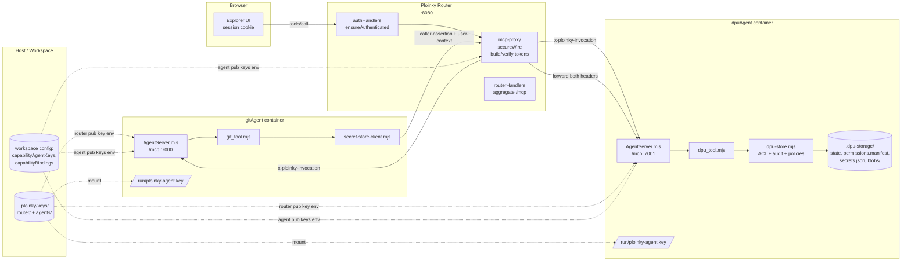

# Agent-to-Agent Communication, Authentication, and Authorization

Scope: how `ploinky/` (the router + agent container runtime) mediates calls
between agents, and how the two reference agents in this repository —
`AssistOSExplorer/gitAgent` (consumer of secret storage) and
`AssistOSExplorer/dpuAgent` (provider of secret storage, confidential objects,
and audit) — authenticate each other, carry the authenticated user, and
enforce authorization.

Source code references use `path:line` notation.

---

## 1. Components and trust roles

| Component | Role | Keypair | Principal id |
|---|---|---|---|
| Ploinky router (HTTP server in `ploinky/cli/server/RoutingServer.js:1`) | Central broker, session store, MCP proxy | Ed25519 router session key in `.ploinky/keys/router/session.key` + `.pub` | `ploinky-router` (`iss` of router-signed tokens); first-party caller is `router:first-party` |
| Agent container (`ploinky/Agent/server/AgentServer.mjs:1`) | Streamable MCP server inside each agent container, verifies requests before invoking tools | Mounted agent Ed25519 private key at `/run/ploinky-agent.key` (see `ploinky/cli/services/docker/agentServiceManager.js:386`) | `agent:<repo>/<agent>` (e.g. `agent:AssistOSExplorer/dpuAgent`) |
| `gitAgent` | Consumer: calls DPU directly for secret storage | Ed25519 agent keypair `agent:AssistOSExplorer/gitAgent.key` / `.pub` | `agent:AssistOSExplorer/gitAgent` |
| `dpuAgent` | Provider: owns encrypted secrets, confidential files, ACLs, and audit | Ed25519 agent keypair `agent:AssistOSExplorer/dpuAgent.key` / `.pub` | `agent:AssistOSExplorer/dpuAgent` |

Principal ids are derived deterministically by Ploinky from the installed
agent reference (`agent:<repo>/<agent>`). The agent manifests do **not**
declare their own identity (see `AssistOSExplorer/gitAgent/docs/specs/DS05-Security-Auth-and-Operational-Validation.md`
requirement O4a, and `AssistOSExplorer/dpuAgent/docs/specs/DS05-runtime-and-mcp.md`).
The derivation lives in `ploinky/cli/services/agentIdentity.js:1`.


### Component map



---

## 2. Key management and key distribution

Implemented by `ploinky/cli/services/agentKeystore.js:1` and consumed by
`ploinky/cli/services/docker/agentServiceManager.js:380`.

On-disk layout inside the workspace root:

```
.ploinky/keys/
  router/
    session.key           # Ed25519 PKCS8 PEM, 0600 (router signing key)
    session.pub           # Ed25519 SPKI PEM
  agents/
    <URL-encoded principalId>.key   # agent private key
    <URL-encoded principalId>.pub   # agent public key
```

`ensureRouterSigningKey` (`ploinky/cli/services/agentKeystore.js:104`) and
`ensureAgentKeypair` (`ploinky/cli/services/agentKeystore.js:144`) generate and
persist Ed25519 keypairs on first use. Public key material is also mirrored
into the workspace config through `registerAgentPublicKey`
(`ploinky/cli/services/capabilityRegistry.js:482`) under the
`_config.capabilityAgentKeys` map, which is what the router consults at
verification time via `listRegisteredAgentPublicKeys`
(`ploinky/cli/services/capabilityRegistry.js:466`).

When an agent container is launched (docker or podman), the runtime:

1. Looks up or creates the agent principal's keypair
   (`ploinky/cli/services/docker/agentServiceManager.js:385`).
2. Bind-mounts the agent private key read-only at
   `/run/ploinky-agent.key` (constant `AGENT_PRIVATE_KEY_CONTAINER_PATH`).
3. Exports `PLOINKY_AGENT_PRINCIPAL`, `PLOINKY_AGENT_PRIVATE_KEY_PATH`,
   the router public key as `PLOINKY_ROUTER_PUBLIC_KEY_JWK`, and all
   registered agent public keys as `PLOINKY_AGENT_PUBLIC_KEYS_JSON`
   (`ploinky/cli/services/docker/agentServiceManager.js:390-403`).
4. Exports `PLOINKY_ROUTER_URL` / `PLOINKY_ROUTER_HOST` /
   `PLOINKY_ROUTER_PORT` so the agent can call back into the router.

An equivalent bwrap path exists in `ploinky/cli/services/bwrap/bwrapServiceManager.js:332`.

---

## 3. Transports and endpoints

All agent traffic is JSON-RPC over HTTP implementing MCP Streamable HTTP.

| Endpoint | Listener | Purpose |
|---|---|---|
| `POST /mcp` on the router (default port 8080) | `handleRouterMcp` in `ploinky/cli/server/routerHandlers.js:721` | Aggregated MCP surface across all registered agents (first-party) |
| `POST /mcps/<agent>/mcp` on the router | `handleAgentMcpRequest` in `ploinky/cli/server/mcp-proxy/index.js:243` | Per-agent MCP endpoint used both for first-party browser traffic and for delegated agent-to-agent traffic |
| `POST /mcp` on each agent container (default port 7000) | `AgentServer.mjs` streamable HTTP server in `ploinky/Agent/server/AgentServer.mjs:597` | Executes the tool after verifying the signed wire artifacts |
| `GET /health`, `GET /getTaskStatus` on each agent | same server | Readiness + async task polling (no auth) |

The router never tunnels raw MCP sessions from browser clients down to
provider agents; it opens a short-lived `AgentClient` session (`ploinky/cli/server/AgentClient.js:1`)
per proxied `tools/call`, injecting the signed headers built by
`buildRequestHeadersForToolCall` (`ploinky/cli/server/mcp-proxy/index.js:158`).

---

## 4. Authentication of humans at the router

Defined in `ploinky/cli/server/authHandlers.js:1`. Modes:

- `none` — passthrough.
- `local` — hashed credentials in a workspace-managed variable, session
  cookie `ploinky_local`, sessions in `ploinky/cli/server/auth/localService.js`.
- `sso` — OIDC-style flow via `ploinky/cli/server/auth/service.js` bound to
  a provider agent that advertises the `auth-provider/v1` contract; session
  cookie `ploinky_sso`.

`ensureAuthenticated` (`ploinky/cli/server/authHandlers.js:678`) resolves
the session by cookie, attaches `req.user`, `req.session`, `req.sessionId`,
`req.authMode`. This is the only "human" authentication path. The legacy
bearer-token "agent authentication" endpoint returns
`legacy_agent_bearer_auth_removed` (`ploinky/cli/server/authHandlers.js:671`).

`ensureAuthenticated` runs on every router route except:
- `/health`, `/MCPBrowserClient.js`
- agent MCP proxy routes (`/mcps/...`) — they verify inside the proxy
  because the signed artifact must be matched against the exact JSON-RPC
  body that was signed (`ploinky/cli/server/RoutingServer.js:180`).
- explicitly public tokenized service routes
  (`isPublicHttpServiceRoute`).

---

## 5. Secure-wire: tokens, headers, and verification

### 5.1 Headers

Three HTTP headers carry authenticated context on the wire. Defined in
`ploinky/Agent/lib/runtimeWire.mjs:9`:

| Header | Purpose |
|---|---|
| `x-ploinky-invocation` | Router-minted invocation token (first-party, router-signed) |
| `x-ploinky-caller-assertion` | Caller-agent-signed JWS proving the caller's identity (direct agent-to-agent) |
| `x-ploinky-user-context` | Router-signed user-context token carrying the authenticated end user |

An agent container accepts either shape (router-minted invocation **or**
caller-assertion + user-context pair) and refuses requests that have
neither (`ploinky/Agent/server/AgentServer.mjs:386`).

### 5.2 Token formats

All tokens are compact JWS with `alg = EdDSA`. The canonical body hash used
in `body_hash` is the SHA-256 of the canonical JSON of
`{ tool, arguments }`, deterministically serialized by `canonicalJson`
(`ploinky/Agent/lib/wireSign.mjs:44`).

**Caller assertion** (`signCallerAssertion` in `ploinky/Agent/lib/wireSign.mjs:83`):

```json
{
  "iss": "<caller agent principal>",
  "aud": "<provider agent principal | ploinky-router>",
  "iat": <seconds>,
  "exp": <seconds, iat+45 default, hard cap 120>,
  "tool": "secret_get",
  "scope": ["secret:read"],
  "body_hash": "<base64url sha256 of canonical {tool, arguments}>",
  "jti": "<random base64url>",
  "user_context_token": "<router-minted JWS | absent>",
  "binding_id": "<string | absent>",
  "alias": "<string | absent>"
}
```

Signed with the caller's Ed25519 private key. JWS header carries
`kid = <caller principal>` so the verifier knows which public key to pick.

**Router session token** (user-context or invocation — both produced by
`signRouterToken` in `ploinky/Agent/lib/wireSign.mjs:138`):

Invocation token payload (built by `buildInvocationPayload` in
`ploinky/cli/server/mcp-proxy/secureWire.js:76`):

```json
{
  "iss": "ploinky-router",
  "sub": "<caller principal | 'router:first-party'>",
  "aud": "<provider principal>",
  "workspace_id": "default",
  "binding_id": "",
  "contract": "",
  "scope": [],
  "tool": "git_push",
  "body_hash": "<sha256>",
  "jti": "<random>",
  "iat": <seconds>,
  "exp": <seconds, iat+60 default, hard cap 120>,
  "user": { "sub": "...", "email": "...", "username": "...", "roles": [] },
  "user_context_token": "<embedded user-context token>"
}
```

User-context token (minted by `issueUserContextToken` in
`ploinky/cli/server/mcp-proxy/secureWire.js:53`):

```json
{
  "iss": "ploinky-router",
  "aud": "<downstream agent principal>",
  "sid": "<session id>",
  "iat": <seconds>,
  "exp": <iat + 60>,
  "jti": "<random>",
  "user": { "id": "...", "email": "...", "username": "...", "roles": [] }
}
```

### 5.3 Verification rules (shared)

`verifyJws` / `verifyCallerAssertion` / `verifyInvocationToken` in
`ploinky/Agent/lib/wireVerify.mjs:1` enforce:

- Signature matches the resolved public key (router public key for
  router-signed tokens, registered agent public key for caller assertions).
- `iat/exp` present and `exp - iat <= MAX_TTL_SECONDS (120)`.
- `exp` not expired beyond the clock-skew window (30 s default).
- `aud` matches the expected audience.
- `body_hash` matches the canonical body actually received.
- `jti` not already seen within its TTL (in-memory `createMemoryReplayCache`,
  `ploinky/Agent/lib/wireVerify.mjs:231`). The router keeps a
  `delegatedCallerReplayCache` (4096 entries) and each agent keeps its own
  `invocationReplayCache` + `directCallerReplayCache`.

### 5.4 Enabling / disabling

`isSecureWireEnabled` (`ploinky/cli/server/mcp-proxy/index.js:38`) defaults to
`true`; setting `PLOINKY_SECURE_WIRE` to `0`, `false`, or `off` disables the
router-side signing path. The agent-side verification is always on when the
keys are mounted — there is no per-agent opt-out.

---

## 6. Flow A — Browser (first-party) → router → provider agent

This is the Explorer UI calling any tool on `gitAgent` or `dpuAgent`.

```mermaid
sequenceDiagram
    autonumber
    participant B as Browser<br/>(session cookie)
    participant R as Ploinky Router<br/>(:8080)
    participant A as AgentServer<br/>(:7000, in container)
    participant T as Tool process<br/>(git_tool.mjs / dpu_tool.mjs)

    B->>R: POST /mcps/<agent>/mcp<br/>JSON-RPC tools/call {name, arguments}
    R->>R: ensureAuthenticated(cookie)<br/>→ req.user, req.session
    R->>R: buildFirstPartyInvocation<br/>- mint user_context_token (aud=<provider>)<br/>- mint invocation_token<br/>&nbsp;&nbsp;iss=ploinky-router, sub=router:first-party,<br/>&nbsp;&nbsp;aud=<provider principal>, tool, body_hash, user
    R->>A: POST /mcp (short-lived AgentClient)<br/>x-ploinky-invocation: <token>
    A->>A: verifyInvocationFromHeaders<br/>(router public key, aud, body_hash, jti)
    A->>T: spawn tool wrapper with<br/>metadata.invocation = verified grant
    T-->>A: tool JSON result
    A-->>R: JSON-RPC result
    R-->>B: JSON-RPC result
```

Key code paths:

- Router mints tokens in `buildFirstPartyInvocation`
  (`ploinky/cli/server/mcp-proxy/secureWire.js:123`).
- Router attaches them per tool call in
  `buildInvocationContextForProviderCall`
  (`ploinky/cli/server/mcp-proxy/index.js:69`) and `buildRequestHeadersForToolCall`
  (`ploinky/cli/server/mcp-proxy/index.js:158`). Only the exact `tool` name and
  `arguments` are hashed — the token cannot be replayed against a different
  tool or payload.
- Agent verifies in `AgentServer.mjs` inside each tool invocation wrapper
  (`ploinky/Agent/server/AgentServer.mjs:380`). The verified payload becomes
  `context.invocation` and is passed to the child process as
  `payload.metadata.invocation` (`ploinky/Agent/server/AgentServer.mjs:408`).

Authorization at the agent side of Flow A is still the provider's business.
For `dpuAgent`, it is `resolveActor` + `assertInvocationScopeFor` +
`assertSecretPermission` inside `AssistOSExplorer/dpuAgent/lib/dpu-store.mjs`
(see §8). The invocation token acts as the trusted input for identity;
nothing further is needed for the "who is calling" question.

---

## 7. Flow B — Agent (`gitAgent`) → router → Agent (`dpuAgent`)

This is how `gitAgent` stores / retrieves the GitHub access token and
handles device-flow state. It is the reference implementation of the
direct agent-to-agent path. No capability binding is consulted; the
client is DPU-specific by design
(`AssistOSExplorer/gitAgent/docs/specs/DS06-secret-store-v1-client.md`).

### 7.1 Consumer side (`gitAgent`)

Wrapper flow:

1. Explorer UI calls, say, `git_push` on `gitAgent` via Flow A.
2. Router hands `gitAgent` a signed invocation token that embeds the
   original end-user context and a `user_context_token` pinned to
   `agent:AssistOSExplorer/gitAgent` (see §6).
3. `git_tool.mjs` reads the envelope, runs
   `authInfoFromInvocation(metadata.invocation)`
   (`AssistOSExplorer/gitAgent/tools/git_tool.mjs:18`,
   `ploinky/Agent/lib/invocation-auth.mjs:1`).
4. To fetch or store the token, `github-auth.mjs` calls the helpers exported
   from `AssistOSExplorer/gitAgent/lib/secret-store-client.mjs:241`.
5. `createSecretStoreClient` (`AssistOSExplorer/gitAgent/lib/secret-store-client.mjs:146`)
   uses `signCallerAssertion` from the container-provided
   `/Agent/lib/wireSign.mjs` module to sign a fresh assertion scoped to the
   operation:

   | Op | Scope |
   |---|---|
   | `secret_get` / `secret_list` | `secret:read` |
   | `secret_put` / `secret_delete` | `secret:write` |
   | `secret_grant` | `secret:grant` |
   | `secret_revoke` | `secret:revoke` |

   Mapping defined in `scopesForOperation`
   (`AssistOSExplorer/gitAgent/lib/secret-store-client.mjs:128`).
6. The assertion is signed with the private key read from
   `PLOINKY_AGENT_PRIVATE_KEY_PEM` / `PLOINKY_AGENT_PRIVATE_KEY_PATH` /
   `.ploinky/keys/agents/<principal>.key`
   (`AssistOSExplorer/gitAgent/lib/secret-store-client.mjs:56`). Audience is set
   to the DPU principal (`agent:AssistOSExplorer/dpuAgent`) and the JWT
   carries the `user_context_token` unchanged inside the body:
   `payload.user_context_token` + `x-ploinky-user-context` header.
7. The client POSTs exactly one JSON-RPC `tools/call` to
   `{PLOINKY_ROUTER_URL}/mcps/dpuAgent/mcp` with both the assertion
   (`x-ploinky-caller-assertion`) and user-context token
   (`x-ploinky-user-context`) headers. No MCP `initialize` is performed.

Endpoint of this call lands back at the router's MCP proxy, which is why
the consumer talks through the router rather than directly to DPU's
container port.

### 7.2 Router side (`handleAgentMcpRequest`)

`ploinky/cli/server/mcp-proxy/index.js:243` detects an "agent delegated"
request because the two agent headers are present, and then:

1. Requires **both** headers; otherwise responds 401 `incomplete_agent_auth`.
2. Requires JSON-RPC `tools/call`; delegated calls cannot `initialize`, list
   tools, or read resources. This enforces the "stateless, single-call"
   pattern documented in DS06.
3. Calls `verifyDelegatedToolCall`
   (`ploinky/cli/server/mcp-proxy/secureWire.js:165`):

   - Resolves the provider descriptor by agent-ref name.
   - Verifies the caller assertion against the registered agent public
     keys (`listRegisteredAgentPublicKeys`). `aud` must equal the provider
     principal. `body_hash` must match the exact `{tool, arguments}` sent.
     `jti` runs through the delegated replay cache.
   - Requires a forwarded `x-ploinky-user-context`. If the caller
     assertion embeds its own `user_context_token`, the two strings must
     be byte-equal; else rejected.
   - Verifies the user-context token against the router public key and
     requires `aud == <caller principal>` — this is what pins the token
     to a single hop. The verifier here is `verifyJws`.
4. Marks the request as `req.delegatedAgentVerified = true`.
5. Opens an `AgentClient` toward `http://127.0.0.1:<dpuPort>/mcp` and
   forwards the original `x-ploinky-caller-assertion` +
   `x-ploinky-user-context` pair unchanged via
   `buildRequestHeadersForToolCall` (the `directHeaders` branch in
   `ploinky/cli/server/mcp-proxy/index.js:87`). The router does **not**
   re-sign or convert the call into a router-minted invocation for
   delegated calls.

### 7.3 Provider side (`dpuAgent` AgentServer)

`ploinky/Agent/server/AgentServer.mjs:386` decides between two paths by
inspecting which headers are present:

- Invocation token present → `verifyInvocationFromHeaders`
  (`ploinky/Agent/lib/runtimeWire.mjs:95`) using the router public key.
- Otherwise, both caller-assertion and user-context headers present →
  `verifyDirectAgentRequest` (`ploinky/Agent/lib/runtimeWire.mjs:123`).
- Neither → request rejected with `-32600 Invocation rejected: missing secure wire headers`.

`verifyDirectAgentRequest` mirrors the router-side verification (using
`PLOINKY_AGENT_PUBLIC_KEYS_JSON` and `PLOINKY_ROUTER_PUBLIC_KEY_JWK` for key
material) and builds a normalized invocation payload via
`buildDirectInvocationPayload` (`ploinky/Agent/lib/runtimeWire.mjs:70`) with
`iss = "direct-agent-wire"`, `sub = <caller principal>`,
`aud = <self principal>`. The verified grant is attached to the tool
metadata exactly as in the first-party path.

`dpu_tool.mjs` then runs `authInfoFromInvocation`
(`AssistOSExplorer/dpuAgent/tools/dpu_tool.mjs:32`,
`ploinky/Agent/lib/invocation-auth.mjs:1`) to reconstruct the agent/user
blob consumed by `lib/dpu-store.mjs`. The resulting shape is:

```js
{
  agent: { principalId: 'agent:AssistOSExplorer/gitAgent', name: 'AssistOSExplorer/gitAgent' },
  user: { id, username, email, roles: [...] },
  invocation: {
    scope: ['secret:read'],
    tool: 'secret_get',
    contract: '',
    bindingId: '',
    workspaceId: '',
    userContextToken: '<forwarded token>'
  }
}
```

---

## 8. Authorization inside `dpuAgent`

`dpuAgent` applies layered checks before returning any data. All of them
live in `AssistOSExplorer/dpuAgent/lib/dpu-store.mjs` and its internal
helpers.

### 8.1 Invocation scope gate

`assertInvocationScopeFor(operation, authInfo)`
(`AssistOSExplorer/dpuAgent/lib/dpu-store.mjs:79`) checks that at least one
scope in the verified caller assertion / invocation token matches the
per-operation scope contract defined in `OPERATION_SCOPE_MAP`
(`AssistOSExplorer/dpuAgent/lib/dpu-store.mjs:61`):

| Operation | Allowed scopes |
|---|---|
| `secret_get` | `secret:read` |
| `secret_put` | `secret:write` |
| `secret_delete` | `secret:write` |
| `secret_grant` | `secret:grant`, `secret:write` |
| `secret_revoke` | `secret:revoke`, `secret:write` |
| `secret_list` | `secret:access`, `secret:read` |
| `secret_whoami`, `dpu_workspace_roots` | `secret:access`, `secret:read` |

When no `invocation` context is present (first-party local path or legacy),
the gate is skipped and only the ACL layer runs.

### 8.2 Actor resolution

`resolveActor(authInfo, permissionsManifest)`
(`AssistOSExplorer/dpuAgent/lib/dpu-store-internal/identity-acl.mjs:111`)
builds a canonical actor record. It prefers:

1. A principal id already known in `permissions.manifest.json` via
   `resolvePrincipalFromManifest` (matches by email, user id, username,
   SSO subject+issuer).
2. Otherwise, a derived principal from `email` → `user:<id>` →
   `user:<username>` → `sso:<sub>` → agent principal id.

Agent identity hints come from `authInfo.agent.principalId` (set by
`invocation-auth.mjs` when `sub` starts with `agent:`). `agentPrincipalId`
and the resolved `principalId` are stored separately so ACL evaluation can
match either the user or the agent.

`requireAuthenticatedActor`
(`AssistOSExplorer/dpuAgent/lib/dpu-store-internal/identity-acl.mjs:139`)
rejects with `Authentication required.` when no principal can be derived.

### 8.3 Resource ACLs

Secrets:

- Roles ordered `access → write-access → read → write`
  (`SECRET_ROLE_ORDER` in `identity-acl.mjs:13`).
- `getSecretRole` (`dpu-store.mjs:345`) merges the caller's roles across
  all principal candidates (user principal, agent principal, email, id,
  username, `user:local:<name>`) using `buildActorPrincipalCandidates`
  (`dpu-store.mjs:285`). A secret owner implicitly holds `write-access`.
- `secretRoleAllows(role, required)` (`identity-acl.mjs:40`) special-cases
  `write-access`: it is allowed to write but not read. Reading still
  requires an explicit `read` or `write` grant.
- Every secret operation ends in
  `assertSecretPermission(secret, actor, permission, permissionsManifest)`
  (`dpu-store.mjs:434`), which throws `Access denied: missing <permission> on secret <key>` when the check fails.

Confidential objects:

- Roles ordered `access → read → comment → write`
  (`CONFIDENTIAL_ROLE_ORDER`).
- Access is evaluated along the parent chain
  (`getConfidentialRole`, `dpu-store.mjs:395`); ownership is recorded on
  the object record and inherits downward through
  `getConfidentialAncestors`.
- `assertConfidentialPermission` (`dpu-store.mjs:457`) guards each
  operation.

Audit:

- Audit viewing / configuration / policy management requires `admin` or
  `security` role, or the special local admin identity (`hasAuditViewerRole`
  in `dpu-store.mjs:135`).
- `dpu_agent_policy_get` and `dpu_agent_policy_set` are gated through
  `assertAuditViewer` (`dpu-store.mjs:761`).

### 8.4 Agent-policy ceiling (the DPU-side "what can this agent ever hold")

Independent of any grant issued by a user, `dpuAgent` caps the roles an
agent principal may **receive** on a secret. The policy lives entirely
inside DPU storage, not in agent manifests.

- Storage: `permissions.manifest.json → agentPolicies[<principalId>].secrets.allowedRoles`
  (see `dpu-store-internal/permissions-manifest.mjs:125` and
  `AssistOSExplorer/dpuAgent/docs/specs/DS03-secrets-model.md`).
- Enforcement: `assertAgentSecretGrantAllowed`
  (`dpu-store.mjs:449`) runs inside `grantSecret`. It:
  - returns early when the principal is not an agent (`agent:` prefix).
  - throws `Agent secret grant is invalid: no DPU policy exists for <principal>.` when the principal has no policy record. This is a default-deny contract: **DPU must explicitly authorize the agent before any user can grant it a role**.
  - throws `Agent <principal> is not allowed to receive secret role <role>.` when the requested role is not in the allowed list.
- Management: `dpu_agent_policy_get` / `dpu_agent_policy_set` require the
  audit-viewer gate (`admin` or `security` role).

### 8.5 Audit trail

Every mutation runs through `runAuditedMutation`
(`dpu-store.mjs:224`) which appends a JSONL record via
`appendAuditRecordIfEnabled`. Records include the actor principal, agent
principal, target path/key/id, status, and any error message. Audit is
**off by default**; it is turned on via `dpu_audit_config_set` by an
`admin`/`security` actor. The `dpu_audit_event_append` tool lets Explorer
forward UX-level events without giving clients filesystem write access.

---

## 9. End-to-end example: user triggers `git_push`, gitAgent reads GitHub token from DPU

This is the canonical agent-to-agent path exercised by the reference
implementation.

```mermaid
sequenceDiagram
    autonumber
    participant B as Browser<br/>(session cookie)
    participant R as Router :8080<br/>(mcp-proxy)
    participant GA as gitAgent AgentServer<br/>(:7000)
    participant GT as git_tool.mjs +<br/>secret-store-client.mjs
    participant DA as dpuAgent AgentServer<br/>(:7001)
    participant DT as dpu_tool.mjs +<br/>dpu-store.mjs

    Note over B,R: Flow A — first-party call
    B->>R: POST /mcps/gitAgent/mcp<br/>tools/call git_push { path, remote, branch, ... }
    R->>R: ensureAuthenticated(cookie)<br/>buildFirstPartyInvocation<br/>user_context_token.aud = agent:…/gitAgent<br/>invocation.sub = router:first-party<br/>invocation.aud = agent:…/gitAgent<br/>invocation.tool = git_push<br/>body_hash = SHA256(canonicalJson({tool,args}))
    R->>GA: POST /mcp + x-ploinky-invocation
    GA->>GA: verifyInvocationFromHeaders (router pub key)
    GA->>GT: spawn git_tool.sh git_push<br/>metadata.invocation = grant

    Note over GT,R: gitAgent needs GIT_GITHUB_TOKEN → Flow B (delegated)
    GT->>GT: getStoredGitToken →<br/>signCallerAssertion<br/>tool=secret_get, scope=[secret:read]<br/>aud=agent:…/dpuAgent<br/>user_context_token forwarded unchanged<br/>body_hash = SHA256({tool,arguments})
    GT->>R: POST /mcps/dpuAgent/mcp<br/>tools/call secret_get { key: GIT_GITHUB_TOKEN }<br/>x-ploinky-caller-assertion + x-ploinky-user-context
    R->>R: verifyDelegatedToolCall<br/>1. caller-assertion sig (gitAgent pub key)<br/>&nbsp;&nbsp;aud = agent:…/dpuAgent, body_hash, jti<br/>2. embedded vs header user_context match<br/>3. verifyJws(user-context, aud = agent:…/gitAgent)
    R->>DA: POST /mcp<br/>forward BOTH x-ploinky-* headers unchanged
    DA->>DA: verifyDirectAgentRequest<br/>(both signatures re-verified inside container)<br/>buildDirectInvocationPayload<br/>sub=agent:…/gitAgent, user=end-user claims
    DA->>DT: spawn dpu_tool.sh secret_get<br/>metadata.invocation = grant

    DT->>DT: assertInvocationScopeFor("secret_get")<br/>→ requires secret:read ✓
    DT->>DT: requireAuthenticatedActor → actor = end user
    DT->>DT: assertSecretPermission(secret, actor, "access")<br/>ACL matches user OR agent principal
    DT->>DT: when role ∈ {read, write}: decrypt secrets.json
    DT->>DT: runAuditedMutation: dpu.secret.get (if audit enabled)
    DT-->>DA: { ok, secret: { key, value, role, ... } }
    DA-->>R: JSON-RPC result
    R-->>GT: JSON-RPC result

    GT->>GT: use plaintext token in<br/>git push https://<token>@...
    GT-->>GA: tool result
    GA-->>R: JSON-RPC result
    R-->>B: JSON-RPC result
```

Replay, scope, audience, and body-hash binding are enforced at **both**
the router hop and the provider hop, so a compromised router node cannot
replay an assertion against a different tool or DPU instance, and a
compromised DPU container cannot trust an assertion whose user-context is
bound to a different caller agent.

---

## 10. Rules of thumb and invariants

1. **Caller identity is never taken from JSON-RPC arguments.** Both agents
   read identity only from `metadata.invocation`, which is the verified
   grant. See `git_tool.mjs` and `dpu_tool.mjs` — they import
   `authInfoFromInvocation` and never construct `authInfo` themselves.
2. **First-party vs delegated is decided by headers.** Invocation token
   header → router-issued first-party. Caller-assertion + user-context →
   agent-delegated. The agent rejects calls that carry neither.
3. **`user_context_token.aud` pins one hop only.** `gitAgent` receives a
   token with `aud = agent:AssistOSExplorer/gitAgent`. It cannot re-aim
   that token at DPU — DPU will reject it because the user-context is
   verified with `aud == caller principal`, which happens to be
   `agent:AssistOSExplorer/gitAgent`, not DPU. The token is therefore
   forwarded **inside** the caller assertion and alongside it in the
   header, never as a standalone bearer to DPU.
4. **Tool and arguments are bound to the signature.** `body_hash` covers
   the canonical serialization of `{ tool, arguments }`, so neither the
   router nor any middlebox can swap the tool name or change argument
   values.
5. **Replay windows are short.** Caller assertions default to 45 s and
   invocation tokens to 60 s (`ploinky/Agent/lib/wireSign.mjs:31`,
   `ploinky/cli/server/mcp-proxy/secureWire.js:24`). A replay cache shrinks
   the window further by refusing any `jti` seen before within its TTL.
6. **Agents can only receive secret roles DPU has pre-approved.** A
   compromised `gitAgent` cannot convince `dpuAgent` to give it `read` on
   an arbitrary secret; the DPU admin must have added the role to the
   `agentPolicies[agent:AssistOSExplorer/gitAgent].secrets.allowedRoles`
   list first.
7. **Legacy bearer auth is disabled.** `ensureAgentAuthenticated` now
   returns `legacy_agent_bearer_auth_removed`
   (`ploinky/cli/server/authHandlers.js:671`); the only accepted
   inter-agent authentication is the signed wire described here.
8. **`x-ploinky-auth-info` has been removed from the provider contract**
   (`AssistOSExplorer/dpuAgent/docs/specs/DS05-runtime-and-mcp.md`). DPU only
   consumes the verified `metadata.invocation`.

---

## 11. File index

Where each concern lives.

- Router HTTP surface: `ploinky/cli/server/RoutingServer.js`
- Browser auth: `ploinky/cli/server/authHandlers.js`, `ploinky/cli/server/auth/*`
- Router MCP proxy & delegated verification:
  - `ploinky/cli/server/mcp-proxy/index.js`
  - `ploinky/cli/server/mcp-proxy/secureWire.js`
- Router aggregate MCP surface: `ploinky/cli/server/routerHandlers.js`
- MCP client used by the router: `ploinky/cli/server/AgentClient.js`
- Keys and registry:
  - `ploinky/cli/services/agentIdentity.js`
  - `ploinky/cli/services/agentKeystore.js`
  - `ploinky/cli/services/capabilityRegistry.js`
- Agent launch, key mounting, env:
  - `ploinky/cli/services/docker/agentServiceManager.js`
  - `ploinky/cli/services/bwrap/bwrapServiceManager.js`
- Signing and verification primitives (shipped into each container):
  - `ploinky/Agent/lib/wireSign.mjs`
  - `ploinky/Agent/lib/wireVerify.mjs`
  - `ploinky/Agent/lib/runtimeWire.mjs`
  - `ploinky/Agent/lib/invocation-auth.mjs`
  - `ploinky/Agent/lib/toolEnvelope.mjs`
- In-container MCP server: `ploinky/Agent/server/AgentServer.mjs`
- gitAgent:
  - tool dispatcher: `AssistOSExplorer/gitAgent/tools/git_tool.mjs`
  - DPU-aware client: `AssistOSExplorer/gitAgent/lib/secret-store-client.mjs`
  - GitHub auth helpers: `AssistOSExplorer/gitAgent/lib/github-auth.mjs`
  - spec: `AssistOSExplorer/gitAgent/docs/specs/DS05-Security-Auth-and-Operational-Validation.md`, `DS06-secret-store-v1-client.md`
- dpuAgent:
  - tool dispatcher: `AssistOSExplorer/dpuAgent/tools/dpu_tool.mjs`
  - domain + ACL + audit: `AssistOSExplorer/dpuAgent/lib/dpu-store.mjs`
  - identity + roles: `AssistOSExplorer/dpuAgent/lib/dpu-store-internal/identity-acl.mjs`
  - permissions manifest + agent policies: `AssistOSExplorer/dpuAgent/lib/dpu-store-internal/permissions-manifest.mjs`
  - spec: `AssistOSExplorer/dpuAgent/docs/specs/DS03-secrets-model.md`, `DS05-runtime-and-mcp.md`
- Ploinky spec: `ploinky/docs/specs/DS006-auth-capabilities-and-secure-wire.md`
