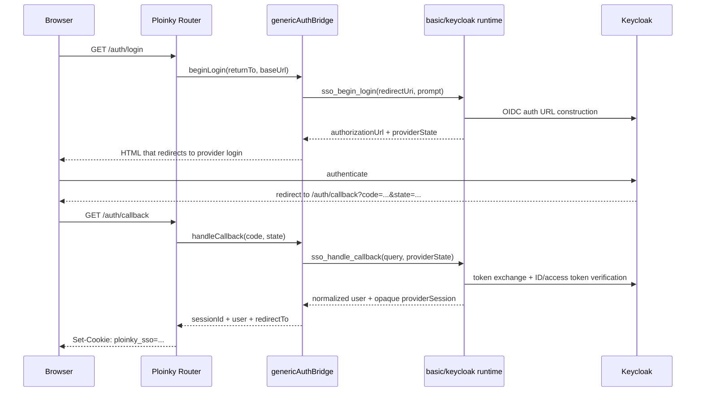
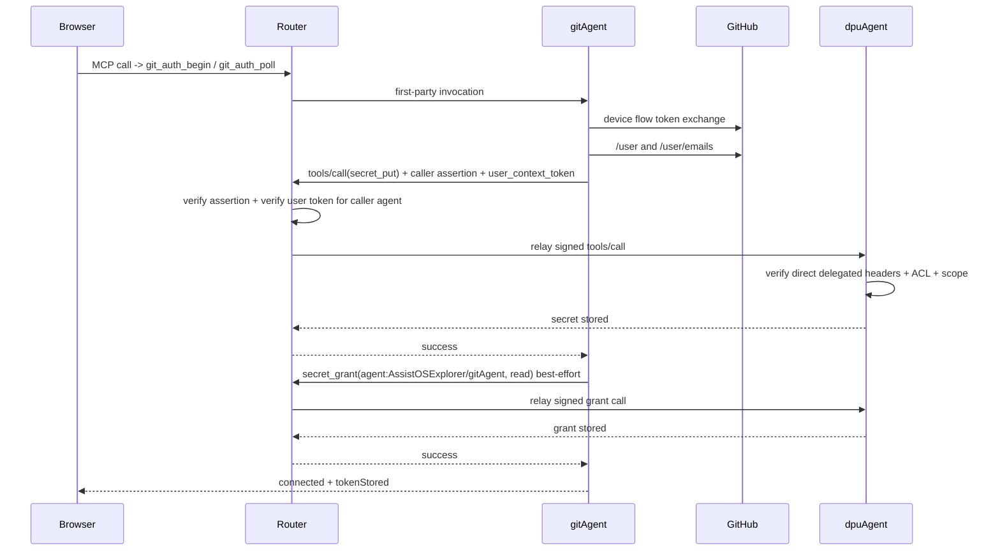
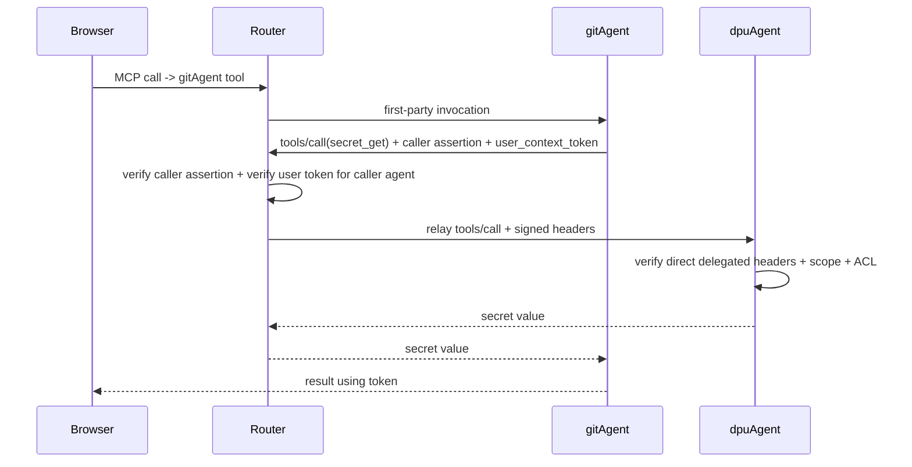

# Current Architecture, Login, and Secret Flows

This document describes the current runtime architecture in the workspace after the capability-registry, secure-wire, and pluggable-SSO refactors, with emphasis on:

1. how Ploinky routes and authenticates requests
2. how `gitAgent` talks to `dpuAgent`
3. how GitHub login metadata, token storage, and token retrieval work today

It documents the code as it exists now, including current migration shims and remaining coupling points.

Important:

- this document describes the current committed implementation
- it does not define the final target architecture after the later clarification that `gitAgent` may be explicitly coupled to `dpuAgent`
- the revised target architecture is documented in [dpu-authority-simplified-architecture-plan.md](/Users/danielsava/work/file-parser/dpu-authority-simplified-architecture-plan.md)
- the focused Git/DPU identity and auth flow is documented in [gitagent-dpuagent-auth-flow.md](/Users/danielsava/work/file-parser/gitagent-dpuagent-auth-flow.md)
- the browser/router/agent routing architecture is documented in [explorer-router-gitagent-dpu-architecture.md](/Users/danielsava/work/file-parser/explorer-router-gitagent-dpu-architecture.md)

## 1. Runtime Architecture

### 1.1 Main components

| Component | Responsibility |
| --- | --- |
| `ploinky/cli` | Workspace runtime, capability registry, agent launchers, router, auth handlers |
| `ploinky/Agent` | Shared agent runtime, MCP server, secure-wire verification |
| `AssistOSExplorer/gitAgent` | Git operations, GitHub device flow, secret-store consumer |
| `AssistOSExplorer/dpuAgent` | Secret/confidential storage provider |
| `basic/keycloak` | `auth-provider/v1` implementation for SSO |

### 1.2 Capability-driven wiring

The current architecture still contains a capability registry in Ploinky core, but the live Git/DPU path is no longer provider-neutral.

- `gitAgent` now directly targets `dpuAgent`
- the router verifies and relays delegated direct calls
- `dpuAgent` owns the final authorization decision
- the capability registry remains relevant for generic SSO/provider-neutral work, not for the Git/DPU storage path

Manifest state after the principal-derivation / DPU-policy pass:

- `AssistOSExplorer/gitAgent/manifest.json` — no `identity`, no `capabilities`, no `requires.secretStore`. Ploinky derives the principal as `agent:AssistOSExplorer/gitAgent`.
- `AssistOSExplorer/dpuAgent/manifest.json` — no `identity`, no legacy `capabilities`, no `provides["secret-store/v1"]`. Only `runtime.resources` + `profiles` remain.
- DPU-owned policy for each agent's secret-role ceiling lives in `permissions.manifest.json -> agentPolicies[<principalId>].secrets.allowedRoles`, managed via `dpu_agent_policy_get` / `dpu_agent_policy_set` admin tools.

### 1.3 Launcher-injected runtime data

When Ploinky starts an agent, the launcher injects:

- `PLOINKY_AGENT_PRINCIPAL`
- `PLOINKY_AGENT_PRIVATE_KEY_PATH`
- `PLOINKY_ROUTER_PUBLIC_KEY_JWK`
- `PLOINKY_ROUTER_URL`

It may still inject capability-binding metadata for other generic capability consumers/providers, but the live Git/DPU path no longer depends on:

- `PLOINKY_CAPABILITY_BINDINGS_JSON`
- `PLOINKY_PROVIDER_BINDINGS_JSON`

This is what allows:

- consumer agents to discover their bound provider without hardcoding it
- consumer agents to sign caller assertions
- provider agents to verify router-issued invocation tokens
- provider agents to validate that a delegated binding is really registered for them

### 1.4 Request path

At a high level, the current request path is:

```text
Browser/UI
  -> RoutingServer
  -> authHandlers / auth service
  -> MCP proxy
  -> secure-wire minting
  -> AgentServer in target agent
  -> tool wrapper
  -> domain logic
```

For delegated agent-to-agent capability calls, the path is:

```text
Browser/UI
  -> router
  -> gitAgent
  -> router
  -> dpuAgent
```

The second hop is not a direct container-to-container trust relationship. It is router-mediated.

## 2. Authentication Architecture

### 2.1 Supported modes

The router currently supports three effective modes:

| Mode | What it does |
| --- | --- |
| `none` | auth endpoints disabled |
| `local` | local username/password login managed inside Ploinky |
| `sso` | external login delegated to a bound `auth-provider/v1` agent |

The mode is resolved in `ploinky/cli/server/authHandlers.js`.

### 2.2 Local login flow

Local login is handled entirely inside Ploinky core.

Flow:

1. Browser requests `GET /auth/login`
2. `authHandlers.js` renders the local login page
3. Browser submits `POST /auth/login`
4. `authenticateLocalUser()` in `ploinky/cli/server/auth/localService.js` validates credentials
5. Ploinky creates a local session and sets the `ploinky_local` cookie
6. Future requests resolve `req.user`, `req.session`, and `req.sessionId` from that cookie

### 2.3 SSO login flow

SSO is provider-neutral in core and provider-specific in the bound agent runtime.

Current provider path:

- workspace binding: `workspace:sso -> auth-provider/v1`
- first implementation: `basic/keycloak/runtime/index.mjs`

Core responsibilities:

- route handling in `authHandlers.js`
- session store and cookie issuance
- pending browser-auth state in `genericAuthBridge.js`
- session refresh and logout orchestration

Provider responsibilities:

- auth URL construction
- PKCE and nonce
- OIDC discovery
- token exchange
- JWKS fetch and JWT verification
- provider-specific claim parsing such as Keycloak role extraction

### 2.4 SSO sequence



### 2.5 User context propagation after login

Once the browser has a valid session:

- `authHandlers.js` resolves the session
- `req.user` contains the normalized user
- `req.sessionId` contains the workspace session id

When the router later sends first-party or delegated capability calls to agents, it can mint a short-lived `user_context_token` signed by the router. That token represents the authenticated browser user and is what lets downstream providers see which human initiated the action.

## 3. Secure Wire Architecture

### 3.1 Core idea

The wire is split into:

1. caller assertion: signed by the calling agent
2. invocation token: signed by the router

This is implemented primarily in:

- `ploinky/Agent/lib/wireSign.mjs`
- `ploinky/Agent/lib/wireVerify.mjs`
- `ploinky/cli/server/mcp-proxy/secureWire.js`
- `ploinky/Agent/server/AgentServer.mjs`

### 3.2 Delegated call flow

For delegated capability calls such as `gitAgent -> dpuAgent`:

1. `gitAgent` signs a caller assertion with its private key
2. `gitAgent` sends a direct JSON-RPC `tools/call` request to the routed DPU endpoint with:
   - `x-ploinky-caller-assertion`
   - `x-ploinky-user-context`
3. the router verifies:
   - signature
   - audience to the target provider
   - TTL
   - body hash
   - replay protection
   - forwarded user token signature
   - forwarded user token audience = caller agent principal
4. the router relays the delegated request to DPU without re-authorizing the Git/DPU operation through capability bindings
5. the provider `AgentServer` verifies the same two signed headers before exposing invocation metadata to the tool

### 3.3 Provider-side verification

`ploinky/Agent/server/AgentServer.mjs` verifies delegated direct calls against:

- caller assertion signature
- expected audience = this agent principal
- caller assertion TTL
- caller assertion body hash
- caller assertion replay cache
- router-signed user-context token
- user-context token audience = caller assertion issuer

If verification succeeds, the invocation metadata is made available to the tool wrapper.

### 3.4 Current accepted wire formats

For the Git/DPU path, agents now accept only:

- `x-ploinky-invocation` for first-party routed calls
- or `x-ploinky-caller-assertion` + `x-ploinky-user-context` for delegated agent calls

## 4. Current Secret-Store Architecture

### 4.1 Current Git/DPU boundary

The current boundary is explicit and DPU-aware:

- caller: `gitAgent`
- provider: `dpuAgent`
- operations: `secret_get`, `secret_put`, `secret_delete`, `secret_grant`, `secret_revoke`, `secret_list`

`gitAgent` uses `AssistOSExplorer/gitAgent/lib/secret-store-client.mjs` as its DPU client.

That client:

- signs caller assertions
- forwards `user_context_token` when available
- sends direct JSON-RPC `tools/call` requests to the routed DPU endpoint
- calls only generic operations:
  - `secret_get`
  - `secret_put`
  - `secret_delete`
  - `secret_grant`
  - `secret_revoke`
  - `secret_list`

### 4.2 Provider implementation

`dpuAgent` is the explicit secret authority for the Git/DPU path. It no
longer advertises a provider-neutral `secret-store/v1` contract in its
manifest, and the active Git/DPU runtime path no longer uses provider
bindings.

Provider-side path:

1. `AgentServer` verifies either the router first-party invocation token
   or the direct delegated `x-ploinky-caller-assertion` +
   `x-ploinky-user-context` pair
2. `AssistOSExplorer/dpuAgent/tools/dpu_tool.mjs` extracts the verified
   `metadata.invocation`
3. `dpu_tool.mjs` builds `authInfo`
4. `AssistOSExplorer/dpuAgent/lib/dpu-store.mjs` enforces:
   - invocation scope
   - DPU-owned `agentPolicies`
   - secret ACL rules

### 4.3 DPU persistence model

`dpuAgent` splits secret data into:

- metadata in `state.json`
- ACLs in `permissions.manifest.json`
- actual secret values in `secrets.json`

`secrets.json` is encrypted with AES-256-GCM using a key derived from `DPU_MASTER_KEY`.

Important distinction:

- `state.json` knows that a secret exists and who owns it
- `permissions.manifest.json` knows who is allowed to access it
- `secrets.json` contains the encrypted values

## 5. GitHub Login Metadata vs GitHub Token Storage

The current GitHub auth implementation in `gitAgent` intentionally separates:

1. UI-visible GitHub connection metadata
2. the actual access token

### 5.1 Metadata stored locally by gitAgent

File:

- `.ploinky/state/git-agent-github-auth.json`

This file contains:

- device-flow pending state
- connection source
- GitHub login/name/email/avatar/profile URL
- scope
- timestamps

It does not store the GitHub access token.

### 5.2 Access token stored in DPU

The real token is stored as a DPU secret under:

- key: `GIT_GITHUB_TOKEN`

Helpers:

- `getStoredGitToken()`
- `putStoredGitToken()`
- `deleteStoredGitToken()`

These are thin wrappers on top of the generic secret-store client.

## 6. Secret Storage Flow

This is the current flow when a user completes GitHub device flow in the Explorer Git modal and `gitAgent` stores the token.

### 6.1 Sequence



### 6.2 Detailed steps

1. The browser triggers GitHub auth through the Git modal.
2. `gitAgent/lib/github-auth.mjs` completes device-flow polling and receives the GitHub access token.
3. `github-auth.mjs` fetches:
   - `https://api.github.com/user`
   - `https://api.github.com/user/emails`
4. `github-auth.mjs` writes connection metadata to `.ploinky/state/git-agent-github-auth.json`.
5. `github-auth.mjs` calls `putStoredGitToken({ token, authInfo })`.
6. `putStoredGitToken()` calls `secret_put("GIT_GITHUB_TOKEN", token)` through `secret-store-client.mjs`.
7. `secret-store-client.mjs`:
   - signs a caller assertion with `gitAgent`’s private key
   - includes the forwarded `user_context_token` when present
   - sends a direct JSON-RPC `tools/call` request to the routed DPU endpoint
8. The router verifies the caller assertion plus the forwarded user token for `agent:AssistOSExplorer/gitAgent`, then relays the call.
9. `dpuAgent` verifies the delegated direct headers in `AgentServer`.
10. `dpu_tool.mjs` reconstructs `authInfo` from the verified invocation metadata.
11. `dpu-store.mjs` enforces:
    - `secret:write` scope
    - secret ACL rules
12. `putSecret()` writes:
    - secret metadata to `state.json`
    - encrypted secret value to `secrets.json`
13. `putStoredGitToken()` then performs a best-effort `secret_grant(key, agent:AssistOSExplorer/gitAgent, read)`.

### 6.3 Ownership and ACL semantics

The important ACL point is:

- the effective actor normally resolves to the delegated human user
- `agentPrincipalId` is still present in the auth context

So today the secret is typically owned by the user principal, not by `gitAgent`.

The extra `secret_grant(..., agent:AssistOSExplorer/gitAgent, read)` call records an explicit agent grant in addition to the user-owned secret. DPU now validates the grantee's role against DPU-owned policy in `permissions.manifest.json -> agentPolicies[agent:AssistOSExplorer/gitAgent].secrets.allowedRoles`. If no policy exists for the agent principal, the grant is rejected. Admins configure the policy through `dpu_agent_policy_set`.

## 7. Secret Retrieval Flow

This is the current flow when `gitAgent` needs the stored GitHub token again.

### 7.1 Typical callers

Common examples:

- `git_auth_status`
- future GitHub-backed git pull/push flows
- any operation inside `gitAgent` that needs the stored token

### 7.2 Sequence



### 7.3 Detailed steps

1. A browser-initiated request reaches `gitAgent`.
2. `gitAgent` calls `getStoredGitToken({ authInfo })`.
3. `getStoredGitToken()` calls `secret_get("GIT_GITHUB_TOKEN")` through the DPU-aware secret-store client.
4. `gitAgent` signs a caller assertion with:
   - issuer = `agent:AssistOSExplorer/gitAgent`
   - tool = `secret_get`
   - scope = `secret:read`
5. `gitAgent` forwards the router-issued `user_context_token` it received on the first hop.
6. The router verifies the delegated request cryptographically and relays it.
7. `dpuAgent` verifies the direct delegated headers and reconstructs:
   - caller agent principal
   - delegated user
   - scope
   - forwarded `user_context_token`
8. `dpu-store.getSecretByKey()` enforces:
   - invocation scope
   - ACL access to the secret
9. DPU reads the encrypted `secrets.json`, decrypts it with the derived secret-map key, and returns the requested value.
10. `gitAgent` uses the token but does not persist it locally in its own workspace files.

## 8. Important Current Nuances

### 8.1 `requires` is no longer part of the Git/DPU communication path

`gitAgent.manifest.json -> requires.secretStore` was removed from the simplified Git/DPU path.

The current Git/DPU path is intentionally DPU-aware:

- `gitAgent` directly targets `dpuAgent`
- the router only verifies and relays the signed delegated request
- DPU owns the authorization decision

### 8.2 DPU-owned agent policies replace manifest allowedRoles

`gitAgent.manifest.json` no longer declares `capabilities.dpu.allowedRoles` or any DPU-specific policy. DPU validates `secret_grant` to agent principals against `permissions.manifest.json -> agentPolicies[<principalId>].secrets.allowedRoles` — the agent manifest is not consulted. If an agent principal has no DPU policy entry, every grant to it is rejected. Admins manage policies through the `dpu_agent_policy_get` / `dpu_agent_policy_set` tools.

### 8.3 User-context tokens are scoped to the immediate caller agent

The router no longer mints broad delegated user tokens for all agents.

Instead:

- first-hop routed calls mint a `user_context_token` with audience = the receiving agent principal
- delegated agent calls must forward that token unchanged
- the router and DPU verify that the token audience matches the caller assertion issuer

### 8.4 First-party and delegated calls coexist

There are two router-issued invocation styles:

- first-party: browser/core -> provider directly
- delegated: browser/core -> consumer agent -> provider agent

The GitHub token storage/retrieval path is delegated on the second hop.

### 8.5 DPU audit starts disabled by design

Fresh DPU state starts with audit disabled.

That is intentional and matches:

- DPU docs
- DPU tests
- the admin audit configuration flow

## 9. Short Summary

The current architecture is:

- provider-neutral for SSO in Ploinky core
- direct and DPU-aware for `gitAgent -> dpuAgent`
- router-verified and relay-based for delegated Git/DPU calls
- DPU-backed for GitHub token storage

The current GitHub token handling is:

- GitHub profile metadata in `gitAgent` local state
- actual access token in DPU encrypted secret storage
- token writes and reads performed through the DPU-aware signed client
- all delegated calls protected by caller assertions, immediate-caller-scoped user-context tokens, DPU scope checks, and DPU ACL validation

There are no remaining manifest-level coupling points between `gitAgent` and DPU. Agent principals are derived by Ploinky (`agent:<repo>/<agent>`); DPU owns secret-role policy via `agentPolicies`.
