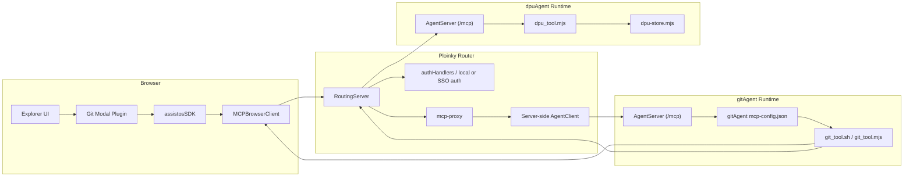
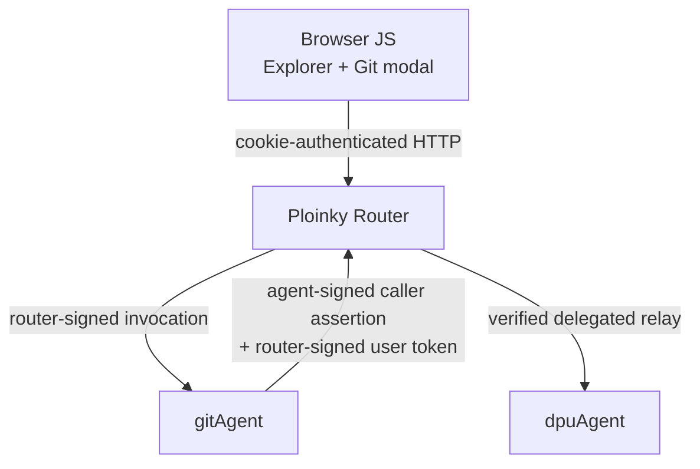
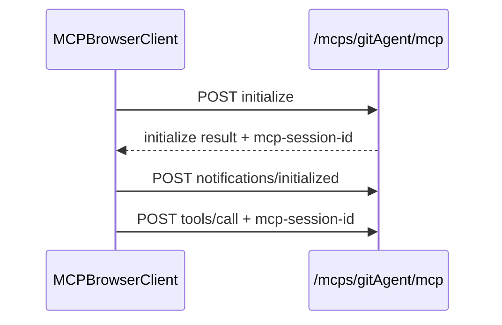
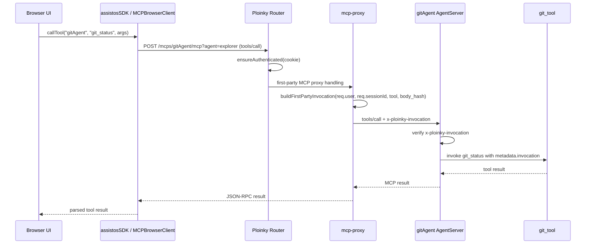
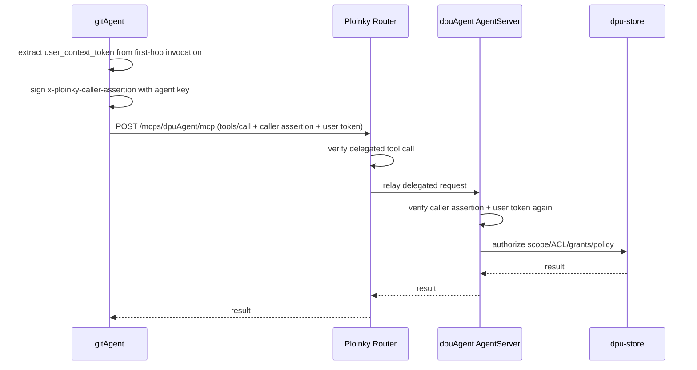

# Explorer, Router, gitAgent, and dpuAgent Architecture

This document explains the current runtime architecture for the Explorer Git
workflow, with emphasis on:

1. what runs in the browser
2. what runs in the Ploinky router
3. what runs in `gitAgent`
4. how MCP requests are routed
5. how the first hop differs from the delegated `gitAgent -> dpuAgent` hop

This is the current implementation on `feature/capabilities-wire-sso`.

## 1. High-Level Architecture

### 1.1 Deployment view

### 1.2 Trust boundaries

The browser is trusted only as a session-bearing client. It is not trusted to
assert user identity or agent identity on its own.

## 2. What Runs in the Browser

The browser-side stack is:

- Explorer UI
- the Git toolbar/modal plugin
- `assistosSDK`
- `MCPBrowserClient`

Relevant files:

- [AssistOSExplorer/explorer/services/assistosSDK.js](/Users/danielsava/work/file-parser/AssistOSExplorer/explorer/services/assistosSDK.js)
- [ploinky/Agent/client/MCPBrowserClient.js](/Users/danielsava/work/file-parser/ploinky/Agent/client/MCPBrowserClient.js)
- [AssistOSExplorer/gitAgent/IDE-plugins/git-tool-button/components/git-commit-modal/git-commit-modal.js](/Users/danielsava/work/file-parser/AssistOSExplorer/gitAgent/IDE-plugins/git-tool-button/components/git-commit-modal/git-commit-modal.js)
- [git-commit-modal-service.js](/Users/danielsava/work/file-parser/AssistOSExplorer/gitAgent/IDE-plugins/git-tool-button/components/git-commit-modal/git-commit-modal-service.js)

The browser does not:

- run Git commands
- talk directly to `gitAgent`’s internal port
- sign agent assertions
- mint delegated user tokens

Instead, it talks to the router MCP endpoint:

- `/mcps/gitAgent/mcp?agent=explorer`

## 3. What Runs in the Router

The router-side stack is:

- `RoutingServer`
- `authHandlers`
- `mcp-proxy`
- server-side `AgentClient`

Relevant files:

- [ploinky/cli/server/RoutingServer.js](/Users/danielsava/work/file-parser/ploinky/cli/server/RoutingServer.js)
- [ploinky/cli/server/authHandlers.js](/Users/danielsava/work/file-parser/ploinky/cli/server/authHandlers.js)
- [ploinky/cli/server/mcp-proxy/index.js](/Users/danielsava/work/file-parser/ploinky/cli/server/mcp-proxy/index.js)
- [ploinky/cli/server/AgentClient.js](/Users/danielsava/work/file-parser/ploinky/cli/server/AgentClient.js)

The router is responsible for:

- authenticating the browser session
- deciding whether a request is first-party browser traffic or delegated
  agent-to-agent traffic
- minting router-signed first-party invocation tokens for the first hop
- verifying delegated Git/DPU calls before relaying them
- proxying MCP traffic to the target agent

## 4. What Runs in gitAgent

The `gitAgent` runtime typically uses the generic Ploinky `AgentServer`, which:

- exposes `/mcp`
- loads `gitAgent/mcp-config.json`
- dispatches tool calls to the configured shell/script command

Relevant files:

- [ploinky/Agent/server/AgentServer.sh](/Users/danielsava/work/file-parser/ploinky/Agent/server/AgentServer.sh)
- [ploinky/Agent/server/AgentServer.mjs](/Users/danielsava/work/file-parser/ploinky/Agent/server/AgentServer.mjs)
- [AssistOSExplorer/gitAgent/mcp-config.json](/Users/danielsava/work/file-parser/AssistOSExplorer/gitAgent/mcp-config.json)
- [AssistOSExplorer/gitAgent/tools/git_tool.mjs](/Users/danielsava/work/file-parser/AssistOSExplorer/gitAgent/tools/git_tool.mjs)

In practice:

- the browser calls router MCP
- the router calls `gitAgent`’s `/mcp`
- `AgentServer` validates invocation headers
- `git_tool` executes the Git logic

## 5. Why `?agent=explorer` Exists

The target agent is already encoded in the path:

- `/mcps/gitAgent/mcp`

The query parameter:

- `?agent=explorer`

is used by the router to resolve the auth/app context for the calling static
app. In `testExplorer`, that means:

- the route key is `explorer`
- the auth policy for that app is applied
- redirects such as `/auth/login` can preserve the correct return target

It is not the target-agent selector. The path does that.

## 6. First-Hop MCP Session Flow

The browser establishes an MCP session with the router proxy, not directly with
the internal `gitAgent` runtime.

### 6.1 MCP session sequence

The browser-side MCP client:

- performs `initialize`
- stores the returned `mcp-session-id`
- reuses it for later `tools/call`

Relevant implementation:

- [ploinky/Agent/client/MCPBrowserClient.js](/Users/danielsava/work/file-parser/ploinky/Agent/client/MCPBrowserClient.js)

## 7. First-Hop Request Routing: Browser -> Router -> gitAgent

This is the important step for understanding how a Git modal click becomes a
trusted tool call in `gitAgent`.

### 7.1 First-hop sequence

### 7.2 What exactly happens

1. Browser JS calls `assistosSDK.callTool('gitAgent', tool, args)`.
2. `assistosSDK` gets or creates a browser MCP client for:
   - `/mcps/gitAgent/mcp?agent=explorer`
3. The router receives the `tools/call`.
4. Because the request does not contain delegated-agent headers, the router
   treats it as a first-party browser call.
5. The router authenticates the browser using the Ploinky session cookie.
6. The router builds a router-signed first-party invocation token.
7. The router opens a server-side MCP client to the real internal `gitAgent`
   endpoint, usually:
   - `http://127.0.0.1:<hostPort>/mcp`
8. The router forwards the tool call with:
   - `x-ploinky-invocation`
9. `gitAgent`’s `AgentServer` verifies that signed invocation.
10. `git_tool.mjs` receives trusted `metadata.invocation` and reconstructs
    `authInfo`.

## 8. What `metadata.invocation` Represents on the First Hop

After the first hop is verified, `gitAgent` sees:

- the normalized authenticated Ploinky user
- session id
- tool name
- scope list
- embedded `user_context_token`

The browser cookie itself does not reach `git_tool.mjs` as the trust artifact.
The trust artifact is the router-signed invocation payload.

## 9. Second-Hop Request Routing: gitAgent -> Router -> dpuAgent

Once `gitAgent` has trusted first-hop invocation context, it may make a second
delegated call to DPU.

### 9.1 Delegated second-hop sequence

This second hop is different from the first hop:

- first hop uses router-signed `x-ploinky-invocation`
- second hop uses:
  - `x-ploinky-caller-assertion`
  - `x-ploinky-user-context`

## 10. Router Role vs Agent Role

### Router role

- authenticate browser sessions
- establish first-hop invocation context
- reject malformed or unverifiable delegated second-hop requests
- proxy MCP traffic

### Agent role

- `gitAgent`: perform Git operations, optionally call DPU
- `dpuAgent`: enforce final secret-operation authorization

### Why both router and DPU verify

The router verifies delegated Git/DPU calls so `/mcps/*` is not an open blind
proxy.

`dpuAgent` verifies again so it does not have to trust the router purely by
network position.

## 11. Browser/Server Boundary Summary

### Browser

- Explorer UI
- Git modal
- `assistosSDK`
- `MCPBrowserClient`
- knows only routed URLs

### Router

- login/session handling
- MCP session proxy
- first-hop invocation minting
- delegated-call admission verification

### gitAgent server

- internal `/mcp`
- tool registry from `mcp-config.json`
- Git logic in `git_tool`

### dpuAgent server

- internal `/mcp`
- delegated caller verification
- DPU authorization in `dpu-store`

## 12. Related Documents

- [gitagent-dpuagent-auth-flow.md](/Users/danielsava/work/file-parser/gitagent-dpuagent-auth-flow.md)
- [current-architecture-login-secret-flows.md](/Users/danielsava/work/file-parser/current-architecture-login-secret-flows.md)
- [capability-wire-sso-implementation-handoff.md](/Users/danielsava/work/file-parser/capability-wire-sso-implementation-handoff.md)
